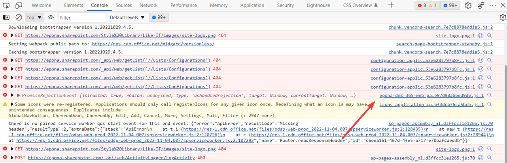

# Report an issue

When resolving issues/errors we need information from the browser developer tools. The browser developer tools can be opened by pressing F12 or CTRL-SHIFT-I (or via the menubar)

Errors are logged to the Console tab. Sharepoint and/or other extensions will also log items to the console. Only messages from epona are caused by Epona365. See example

Errors (or wrong results) can also be caused by network errors. Each network request is logged to the network tab. To minimize the number of request activate the filter *Fetch/XHR*

Here's an example:

To view the details of the request click on the line. *Postquery* is a request to fetch results from the Sharepoint search engine.

You can copy the *HiddenConstraints* and/or *QueryText* text and execute the search within Sharepoint using the normal Search user interface and validate the results (and/or tweak the query to get the correct results).

The request details can be copied via the tab *Payload*, right click, copy object

When reporting an issue:

- describe the steps to reproduce (including screenshots/screencast (for example using [ShareX](https://getsharex.com/))
- check the console tab and copy Epona365 related messages
- check the network tab and copy the Payload
