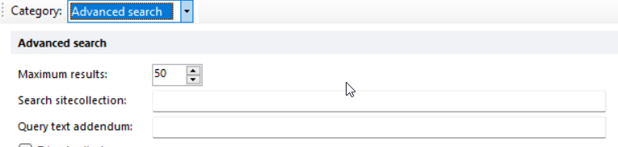
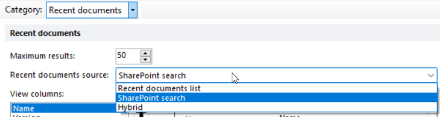

# Epona365

## Documents

Show the documents from Sharepoint. The Query text addendum is used in the My, Recent and All documents view

### All Documents

Show all documents (view permissions on the document).

### My Documents

Show all documents that the current user has created.

### Recent Documents

Show all documents that the current user has modified within the last 90 days. Hybrid mode is not yet supported.

### My Matters

Show all documents that are stored in the my matters.
