# Epona Knowledge Management System (KMS) app

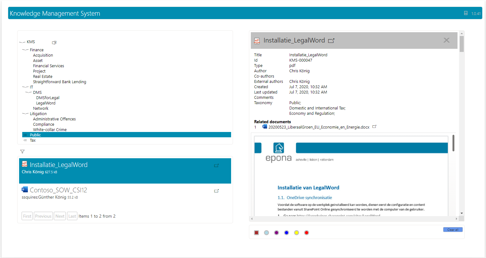 

Epona KMS is a new app, that can be used both on a SharePoint Webpart page, possibly sharing the page with other apps, as well as an app in Teams. It is meant for end-users, and does not have any administrative functions. It allows users to have easy access to documents that often have a company wide relevance, like instruction manuals, special purpose document templates, presentations etc.

The documents can be found using a taxonomy structure, and if necessary in combination with a search text.

## Installation

Installing of the app follows the standard process for SPFX apps. The only difference is that the app is dependent on a setting in the property bag of the root site to be able to know where the DMSforLegal lists are installed (see below).

### >App catalog

A SharePoint site needs an app catalog to be able to handle SharePoint apps. This has to be created only once, and can be checked/created using the admin center:

- Navigate to &lt;the sp-site&gt;-admin.sharepoint.com
- Select the &#39;More Features&#39;, and then open the &#39;Apps&#39;

 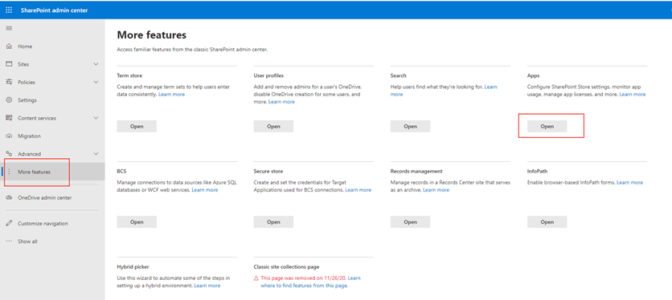

- Select the &#39;App Catalog&#39;.

 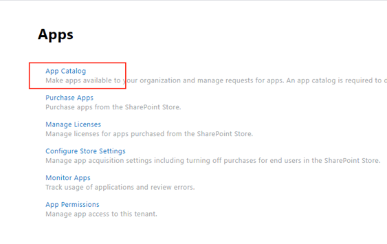

- If the catalog is already present the following screen is shown. For the modern SPFX apps the &#39;Apps for SharePoint&#39; is used. When there is no catalog yet, forms are shown that allows creating one. A commonly chosen location for the app catalog is &#39;sites/apps&#39;.

 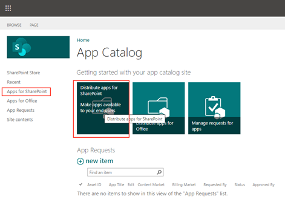

### Adding/updating the app

Like any other (custom) SPFX app the app is installed or updated by dragging the package (kms.sppkg) file on the app catalog page. To have the app available to be added on all sites, check the checkbox, and then click &#39;Deploy&#39;. If the app has been used before on SharePoint pages, then automatically the newer version will be used.

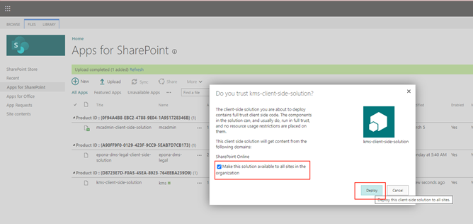

## Available for Teams

To make the app available in Teams, or to have Teams use the latest version, select the &#39;FILES&#39; tab, select the app row and the click &#39;Sync to Teams&#39;. Sometime later SharePoint will confirm this action.

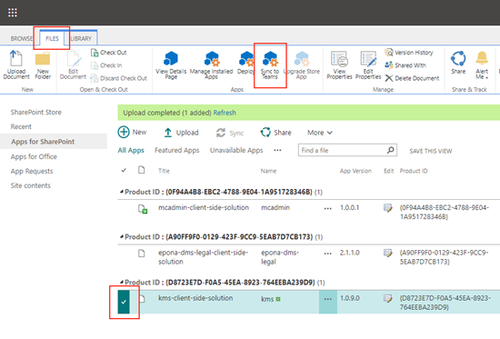

### KMS SPFX needs a property bag setting

In order to allow the KMS app to be working on any site of the tenant, and to work as Teams app, the app needs to know where the DMSforLegal lists are installed. This is resolved by adding a property to the property bag of the root site, that contains the path to the DMSforLegal. This setting can be added in 2 ways:

- Using PnPPowerShell as admin, for example:
Set-PnPPropertyBagValue -Key &quot;DMS\_SiteCollection&quot; -Value &quot;https://&lt;tenants-sp&gt;/sharepoint.com/sites/dmsforlegal&quot;
- Update KMS using the Client Configuration Tool. The update will not install the SPFX app, but will check whether the property bag key has been set correctly.

### Add KMS app to a SharePoint Page

This step is also exactly similar to adding any other app. A default for Epona would be to create a SharePoint page called &#39;kms&#39; within the Site Pages folder of the DMSforLegal site collection. For the new experience, a WebPart page template can be chosen.

The old interface shows the KMS webpart in the &#39;Other&#39; folder, the newer SharePoint layout has a search form to find the app.

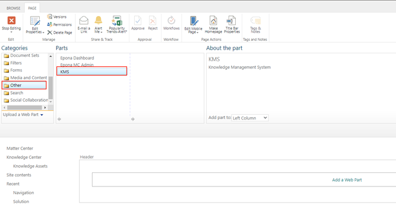

### Add app in Teams

In Teams, KMS can also be installed using the normal procedure for custom apps.

The app should be available if it has been distributed to teams, as described earlier:

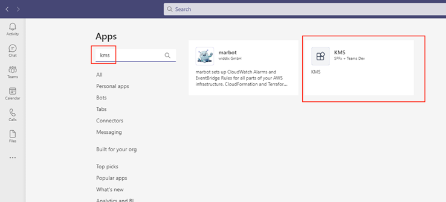

If not it can also be sideloaded. Select the &#39;Apps&#39;, click &#39;Upload a custom App&#39;, change the dialog to display &#39;all files&#39;, and select the kms.sppkg.

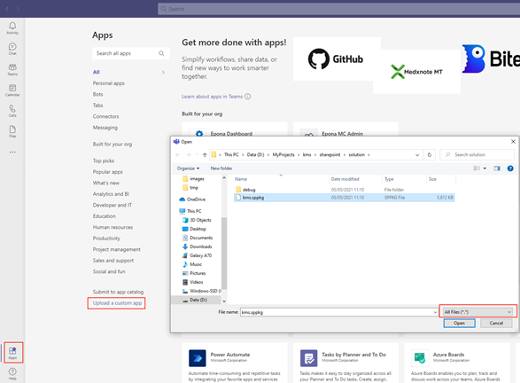

When the app is chosen from the top image, just follow the instructions to add it to a Teams site.

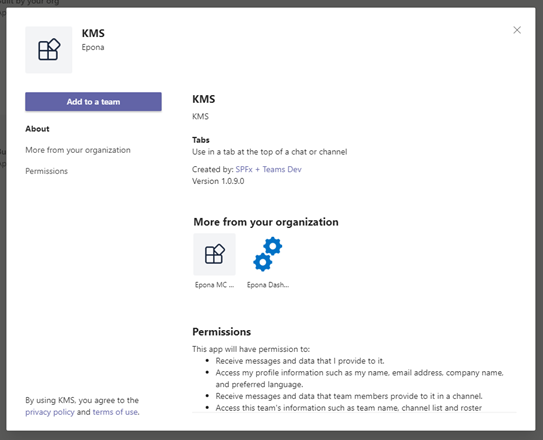

## Further configuration

The app shares it configuration settings with the earlier KMS. Therefore, all settings are found in the DMS Configuration list, under de &#39;KMS&#39; category, and can be set using the Client Configuration Tool.

## Features and limitations

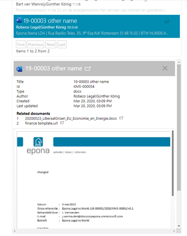

Contrary to former web-app, the SPFX app only uses SharePoint Search for finding results. Therefore updates to the KMS doclib will not immediately be reflected in the app.

The app allows selection of multiple taxonomy items at a time, by holding the Ctrl key while selecting. Selecting a parent node will also reveal documents registered with one of the child nodes.

Previews of documents are stacked within the preview section when clicked, having latest clicked on top. Only when another selection is chosen in the taxonomy tree, he preview section is cleared.

Above the preview the most important document properties are displayed, as well as a list of related documents, if present.

Previews are supported for Office documents, .pdf, .msg, the most used image formats and 3d models in the .glb format. When an link to file (.url) has an URL defined, the document in the URL is displayed when possible.

Each item has a button to open the document in a separate window, thereby having the browser determining how the file is opened.
