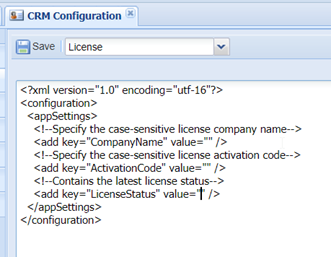

# License Registration

ContactManager will register user licenses  each night during the nightly background job.

The registration information should be added via the CRM Configuration settings:

Specify the company name (case sensitive) and activation code. Click on save and the license will be verified and activated. The current license status will be stored in the LicenseStatus field.

The following information is registered at the Epona Software License Manager:

- Current active URL (see settings General, BaseUrl)
- The email address of the registered user

The Epona Software License Manager is running at <https://slmportal.eponalegal.com/> and should be accessible from the CM Web browser server (disable firewall for that url).

Every night the following users will be registered as an active user in ContactManager. The unique emailaddres is registered:

- User is enabled in CM
- LastLoginDate is recently updated\
  Lastlogin date is updated after a new login via the browser or API (for example via MS Word templates)
- User is assigned to a Matter, Activity, Contact, etc (as responsible, accountmanager, follow user, etc)
- User is using the Outlook synchronisation to sync contacts to the mailbox.

The same license can be used in a test environment. No additional licenses are needed.

To reset the license check, remove the StatuCode in the configuration and Save. Manually run this url to update the license count or wait for the next day, <https://cm/crmconfiguration.aspx/Run/CheckLicense>
