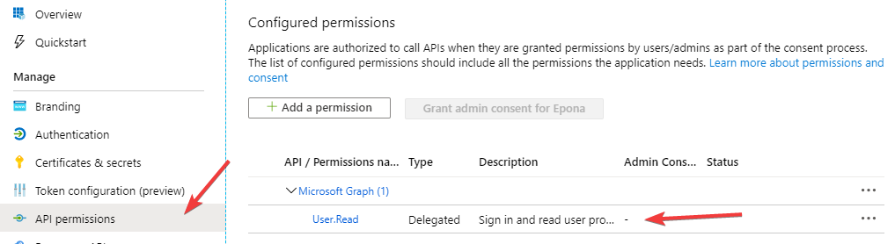

# O365 Login - Manual

## Setting up Azure App registration

The main idea is that the Epona azure portal contains an App Registration for ContactManager. But
this app registration can be created on the tenant of choice. The registration should be configured with
the settings described below.

### Account types

When creating a new app registration, you will have to choose which account types may access the
application. First option will allow users known in the current tenant to authenticate. Second option
will allow any tenant to authenticate and the last option also allows “common” Microsoft accounts to
authenticate (e.g. username@outlook.com).


### Redirect URI's

When connecting a new CM environment, you need to add a redirect URI to the app registration. This
URI should point to the authorize page of the ContactManager installation:

```text
https://someinstallation.eponalegal.com/Login.aspx/Authorize
```

Replace the first part of the URL with the installation URL in question.

### Permissions

The permission for scope “Microsoft.Graph > User.Read” should be added.



### Implicit Grant

The checkbox to enable implicit grant flows for access tokens and ID tokens should be checked in order to request
data directly with a token.


When all that is set, you are ready to configure ContactManager. Keep the tab with the app
registration open, because you will need ids from the overview tab.

## Setting up ContactManager

Open the CRM Configuration screen and navigate to the General configuration. Within this
configuration you will find four settings that can be set for the Office365 implementation.


These settings are described below.

### EnableOffice365Login

This does exactly what the name tells us, this will enable or disable the O365 login functionality. (e.g.
the O365 login button will be hidden when disabled)

### EnableOffice365LoginAccountRegistration

Enable this if you want a new user that has authenticated with O365, but hasn’t got an account in
ContactManager, to register a new account. This account will be disabled by default, and an email will
be sent to the data steward about this registration, so that the account can be finished and enabled
by the administrator.

### Office365ClientID

This is the client Id of the app registration. This id can be found here:


### Office365AdditionalAllowedClientIds

This field can be populated with multiple app/client id’s separated by a semicolon( ; ) or a comma( , ). These client ids will be accepted when validation a token when logging in with an Office 365 account. Add "abcac0c1-7028-44d0-b3de-a93362fb0072" to allow the Epona multi tenant app used by applications like LegalWord.

### Office365TenantID

This is the ID underneath the client ID. Set this to the tenant you wish to use to authenticate to.
Easier is to enter the domain name in this setting like so:


This value is used to create the redirect URL to which you will authenticate (either domain name or
tenant id is accepted):
<https://login.microsoftonline.com/##TENANTIDGOESHERE##/oauth2/v2.0/authorize>(...)

To accept all Microsoft accounts, you could choose “common”, but this is not recommended as this
allows any (known) microsoft account to log onto ContactManager.

## How to use it

When all the settings are set and O365 authentication is enabled, you can login by using O365 in the
ways described underneath.

### Using the website

Once you reach the login page, there will be an extra button that states the ability of logging in by
your Microsoft account.


Clicking this will redirect you to the login page on the Microsoft tenant that is set in the
configuration.

Login with your account details and submit the form. When ContactManager has found a user for
your email address, it will be logged in (if not disabled, otherwise the user gets a notification about
this).

### Using the webservice

Whenever someone tries to log onto the webservice, a username and password is needed. With this
new functionality, it is possible to supply a username (email address) and an access token as the
password. ContactManager will then validate the token data, and if all is valid and matches a user in
the database, it will log the user in.

## Data flow

### Logging in with O365 Account using the website

Authentication via the website is pictured in the next activity diagram. Some actions are simplified to
keep the diagram simple.


