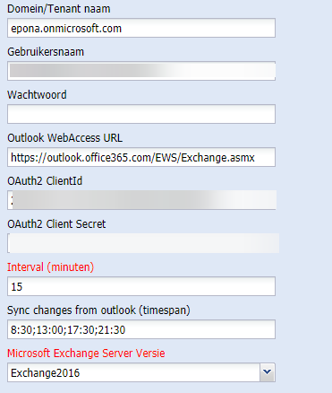

# Exchange configuration - Azure APP

## Register your application

To use OAuth, an application must have an application ID issued by Azure
Active Directory. In this tutorial, it is assumed that the application
is a console application, so you need to register your application as a
public client with Azure Active Directory. You can register an
application in the Azure Active Directory admin center or by using
Microsoft Graph.

- Open a browser and navigate to the Azure Active Directory admin
    center and login using a personal account (aka: Microsoft Account)
    or Work or School Account.

- Select Azure Active Directory in the left-hand navigation, then
    select App registrations under Manage.

- Select New registration. On the Register an application page, set
    the values as follows.

- Set Name to a friendly name for your app.

- Set Supported account types to the choice that makes sense for your
    scenario.

- For Redirect URI, change the dropdown to Public client (mobile &
    desktop) and set the value to "urn:ietf:wg:oauth:2.0:oob".

- Choose Register. On the next page, copy the values of the
    Application (client) ID and Directory (tenant) ID and save them, you
    will need them later.

## Configure for app-only authentication

To use application permissions, follow these additional steps.

- On the app page under Management, select Manifest.

- On the Manifest page that opens, find the requiredResourceAccess entry (on or about line 47). Modify the resourceAppId, resourceAccess id, and resourceAccess type values as shown in the following code snippet:

```JSON
"requiredResourceAccess": [
   {
      "resourceAppId": "00000002-0000-0ff1-ce00-000000000000",
      "resourceAccess": [
         {
            "id": "dc890d15-9560-4a4c-9b7f-a736ec74ec40",
            "type": "Role"
         }
      ]
   }
],
```

- When you're finished, click Save.

- Select API permissions under Manage. Confirm that the
    full_access_as_app permission is listed.

- Select Grant admin consent for org and accept the consent dialog.

- Select Certificates & Secrets in the left-hand navigation under
    Manage.

- Select New client secret, enter a short description and select Add.

- Copy the Value of the newly added client secret and save it, you
    will need it later.

Information in ContactManager:

- Enter the Application ID in the field "Oauth2 ClientID"

- Enter the client secret ID in the field "Oauth2 Client Secret"

- Click on Save. After saving the secret will dissappear and will be
    saved encrypted in the SQL Database.


