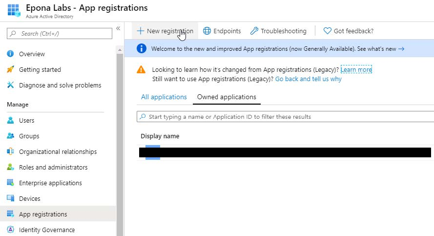
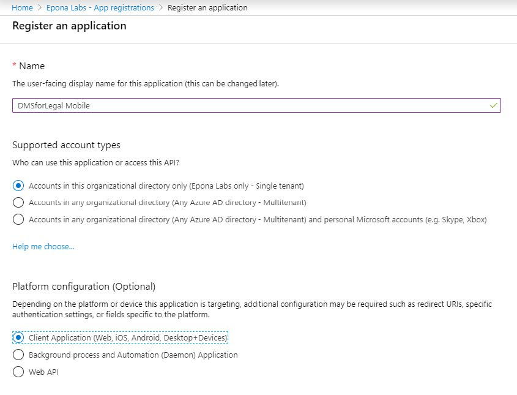
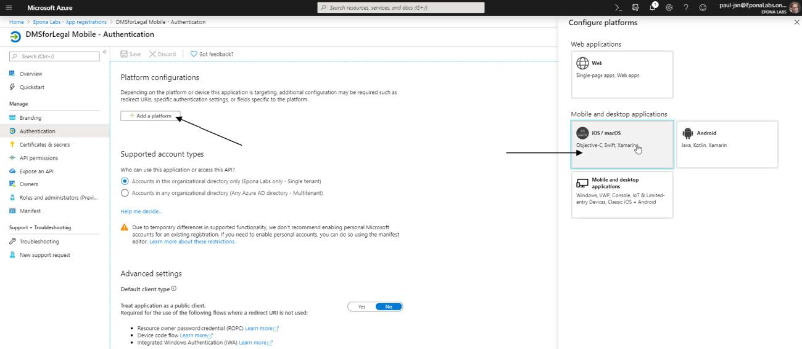
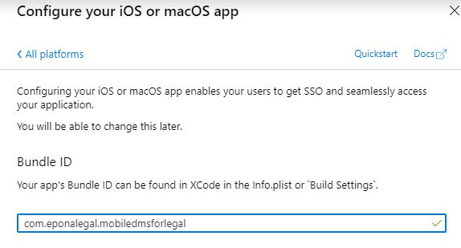
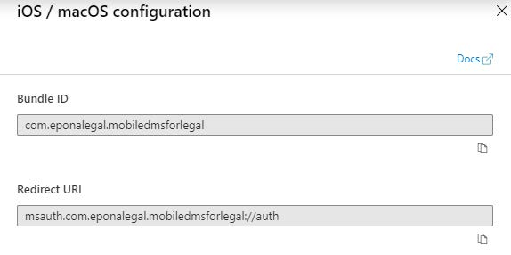
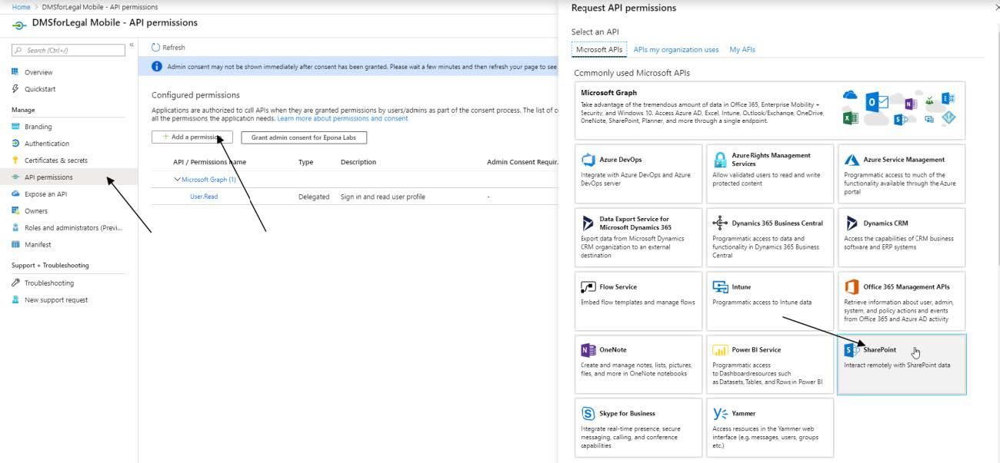
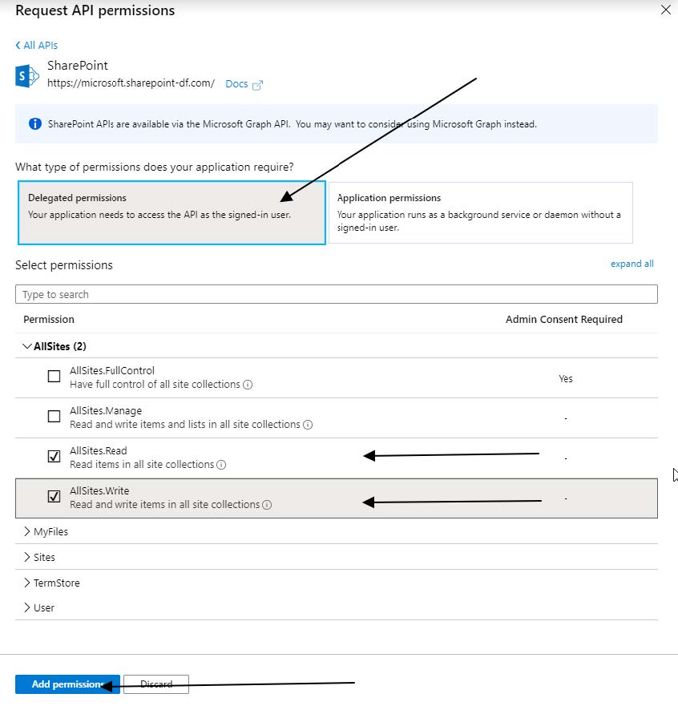
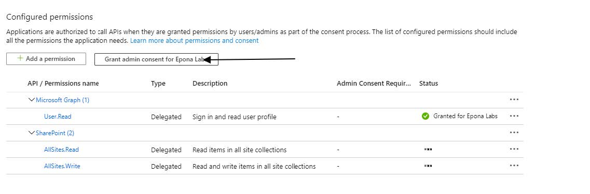
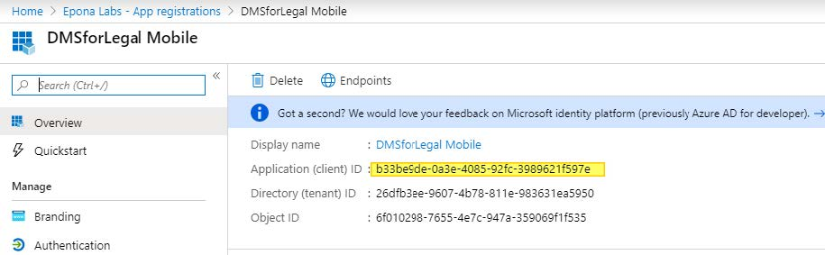

# DMSforLegal Mobile App Registration

1. Sign into portal.azure.com and open Azure Active Directory
1. Navigate to App Registrations, New Registration

3. Name: **DMSforLegal Mobile** ,
    Supported Account Types: Accounts in this organizational directory only
    Platform configuration: Client Application
    [Register]

4. The authentication screen is now selected.
    Add a platform, iOS / macOS

5. The bundle ID of the application is **com.eponalegal.mobiledmsforlegal**
    [Configure]

6. The configuration wizard will now automatically generate the correct redirect URI,
    **msauth.com.eponalegal.mobiledmsforlegal://auth**
    (older versions of the Azure AD Interface required manual configuration of this URL)
    [done]

7. Now that the application is registered, we need to give it permission to access SharePoint. We
    will assign read/write permissions, the specific user permissions take over once the user is
    logged in.
    Open Manage, API permissions.
    Add a Permission, SharePoint

8. Delegated permissions, AllSites.Read & AllSites.Write
    [Add Permissions.]

9. (Optional)
    Grant admin consent for these permissions. If this step is omitted, the users will have to grant
    their explicit consent when they connect with the mobile app.

10. The app has now been successfully registered. Return to the app details screen and copy the
    generated Application Client ID. This is the ID that needs to be registered in the DMSforLegal
    Mobile app on all devices.

