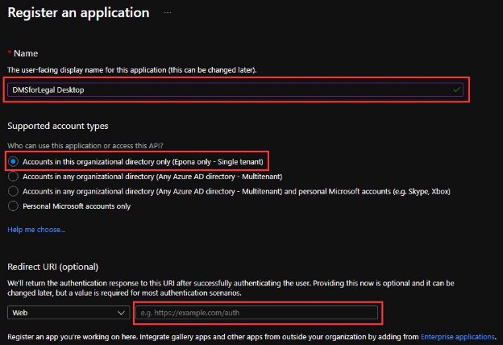

# Enable Modern Authentication in DMSforLegal

## Introduction

Modern Authentication is replacing Browser based authentication. This manual describes the required APP in Azure that needs to be configured to use Modern Authentication in DMSforLegal

## Version changes

- The manual of 29 Oct 2021 did not include [http://localhost](http://localhost/) as a redirect URI for client workstations that do not have Edge Webview installed [(Introduction to Microsoft Edge WebView2 - Microsoft Edge Development | Microsoft Docs)](https://docs.microsoft.com/en-us/microsoft-edge/webview2/)
- User of DMSforLegal 21.3.2 and above is suggested, Modern Authentication is so much faster that timeouts in DMSforLegal l 21.3.1 caused an initial Outlook restart

## Creating the APP

- Login to [https://portal.azure.com.](https://portal.azure.com/)  
- Navigate to **Azure Active Directory** and select **App registrations**.
- Click **New registration**.
- Give the app a name, like: **DMSforLegal Desktop**
- Select **Accounts in this organizational directory only**
- **Do not** fill in a Redirect URI.

- Click **Authentication**, **Add a platform** and then **Mobile and desktop applications**:

- Select **<https://login.microsoftonline.com/common/oauth2/nativeclient>**:

- Click **Add URI** and **Add [http://localhost](http://localhost/)** as a Redirect URI

- When using Windows or Web Access Management (WAM) the APP configuration requires an extra RedirectURI to connect the domain joined computer running a user account on that machine to authenticate against the directory. Click **Add URI** and **Add [ms-appx-web://microsoft.aad.brokerplugin/{your app id}](ms-appx-web://microsoft.aad.brokerplugin/)** as a Redirect URI. Ensure the **{ }** part is not entered, only the APP ID is required here.

- Leave the redirect URI blank and click **Configure**
- Click **API Permissions** and click **Add a permission**:

- Click the **Sharepoint** category:

- Click **Delegated permissions**:

- Select **AllSites.FullControl**:

- Click **Add permissions**.
- Click the **Grand admin consent** button:

- Click **Overview** and copy the **Application (client) ID:**

**Remark:** the DMSforLegal client cached permission tokens in %appdata%\Epona\DMSforLegal\Cache, changes in the APP permissions will require the .msalcache.bin file to be deleted and recreated.

## Configuring Modern Authentication in DMSforLegal

- Open the DMSforLegal configuration dialog and paste the **Aplication ID**:

