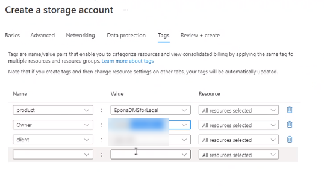

# Installing the Epona DMSforLegal365 APPs

## Goal

- Deploy Azure SQL database and Azure storage account at the client

- Connect Epona DMSforLegal365 APP services to these accounts

- Deploy the APP services

## Required information

IP addresses of Epona APP services (per 1 July 2021, subject to change):

13.75.146.18

52.233.190.74

20.43.22.54

52.165.153.69

## Azure configuration steps

1. Check the Azure subscription that you are going to use. Azure
    services are placed in resource groups and can be connected to a
    subscription.

2. Create the Azure SQL resource

\
3. Choose Azure SQL and select Create

\
4. Choose a **Single database**

5\. Select the appropriate subscription (financial consequences) and the
resource group

6\. Define the Database name and the database server, in this case a new
database server is created.

7\. The database server can host multiple databases, in this case for
the DMSforLegal365 Database a separate database server is created

Choose the Location according to you compliance needs

8\. The database and database server are selected

9\. Geo redundancy is not required, there is data in this database that
can be recreated

10\. Choose Additional settings and change the collation of the database

11\. Ensure you choose: **SQL_Latin1_General_CP850_BIN2**

12\. No SQL Defender services are required

13\. The Tab Networking is important. This is a public available SQL
database that can be accessed by a specific set of IP adresses of
servers from Epona. Choose Public endpoint, at this moment the set of
Epona IP adresses cannot be defined

14\. On the tab TAGs you can define billings tags of this service

15\. Wait untill the deployment completes

16\. Create a SQL user

Connect with SQl Studio to the Azure SQL database

17\. Get the Connection String

**Remark**: the Epona server IP addresses need access to this resource
and a connection string is required with the right username and password

## Setting up the Azure Storage account

1. Choose Create a resource, Storage Account

    

2. Define the subscription, resource group and assign a name to the
    account

    

    Choose your Region of preference

3. Define TAGS for billing purposes

    

4. Review & Create the storage account

    

5. Copy the Connection String

    

    

    Save the connection string in a safe/ vault for later use

# DMSforLegal 365 Portal actions

- Visit the <https://dmsforlegal365.epona.com/#/setup> portal as
    Global Admin to deploy the EmailFiling and DMSforLegal365 APPs to
    your tenant

- Choose **Give consent** to consent to the deployment of these APPs

- Deploy the two APPs, copy the URL to the Custom XML in clipboard

- Enter the URL including HTTPS:// (yes, confusing dialog)

- Define the users or group to deploy it to

- Confirm the deployment

- Now add the other, i.c. Office APP

- The two apps have been deployed

## DMSforLegal365 Setting and configuring Machine Learning

- Initially the DMSforLegal365 settings will point to the root site

    

- Change the Sharepoint URL to reflect the location that hosts the
    Matters, Clients and other DMSforLegal lists

    

- Switch on keyword correlation, there is a Managed choice (hosted in
    Azure by Epona) and a Custom choice. Custom is selected, which means
    that the APP requires connection information to the Azure SQL
    database in your own Azure tenant

    

- Enter the SQL connection string with the appropriate server name,
    login, password information

    

- Choose Initialize database

    

- Click Log to see if the connection information was correct and the
    database intialization has started with the populartion of standard
    data

    

- A Give consent stage is required to allow the APP services to crawl
    existing items and add them to the prediction database

    

    

- Next stage is to activate the OCR crawler process

    

- The OCR service also requires consent. These permissions are
    different from the above consent, because the OCR process is also
    able to write data

    

    

- Enable Delta allows the OCR process to find new Matters and new
    document items

    

- The last stage is to activate Machine Learning. This is more
    extensive than Predictive EmailFiling. Machine Learnings builds a
    database of keywords and requires Azure SQL database and Azure
    storage access

    

- In this case Custom storage is selected. The data is stored in your
    own tenant
    Enter the connection string to the Azure storage resource

    

- Enable Delta machine learning cycles

    

    This is the delta crawling process. It does not trigger complete
    recalculation of the training data, this is a manual step.
