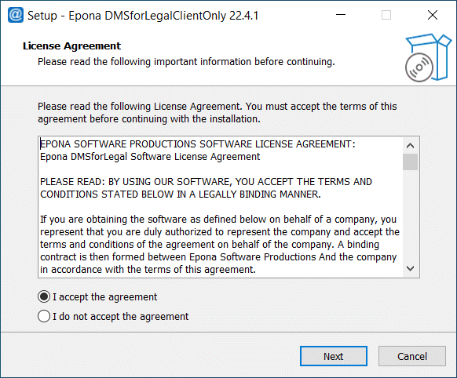
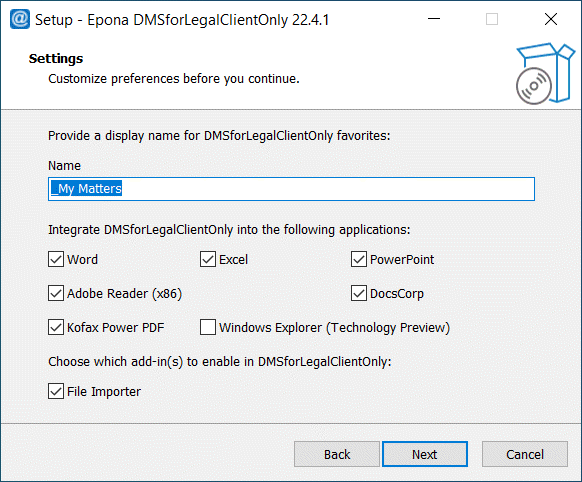
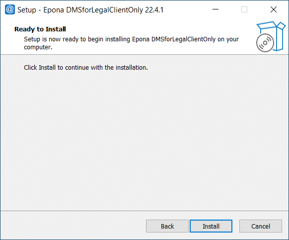
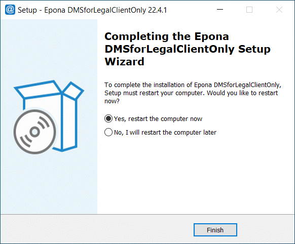

# Manual & Silent Installation

## Introduction

This document describes the unattended (silent) automated installation
of the Epona DMSforLegal client software.

Basically, the installation consists of two steps: (1) deploying the
actual software onto the machine, and (2) configuring it in the
Windows Registry.

## PREREQUISITES

Installing the client requires a 32 or 64-bit version of Office 2013,
2016, 2019, 2021, 365 to be installed on the target machine.

Double-click EponaDMSforLegalClientOnly_2x.x.x_Setup.exe to
execute:

1. Accept the agreement and click next\

1. Leave defaults or change the values\

\
**Warning**: the Windows Explorer (Technology Preview) is an
Explorer.exe shell extension created to upload documents in Internet
Explorer Browser sessions where files from the DMS need to be
uploaded, it cannot be used for other purposes. End users will
probably also try to use this function to Save files, which can result
in data loss. We advise not not use the Windows Explorer (Tech
Preview) unless this restricted use is clear to the users.

1. Finish the installation by clicking install button


1. Restart the computer if needed


## Silently Deploying the Client Software

The client software installer can be silently executed from the
command-line:

```text
EponaDMSforLegal\_\[version\]\_Setup_English.exe /verysilent
/suppressmsgboxes /dir=\[installpath\] /favoritesname=\"\_My matters\" /norestart
```

(Remark: this should all be placed in a single command-line) with:

**[installpath]** the destination path to install DMSforLegal into

**/windowsexplorer** Windows Explorer integration can be installed (Technology Preview)

**/silent** Forces a silent installation, progress is shown

**/verysilent** Forces a silent installation, no progress is shown

**/suppressmsgboxes** No messages boxes will be shown during the installation

**/noOffice** Excel, Word and PowerPoint addin will not be installed

**/noAdobe** Adobe plugin will not be installed

**/noDocsCorp** DocsCorp comparedocs, pdfDocs integration will not be installed

**/noFileImporter** The multi file importer function will not be installed

**/NoKofax** The Kofax (previously Nuance) PowerPDF integration will not be installed

**/favoritesname** The header for the subscribed matters collection (usually "_My matters")

The installer should ideally be executed without any users being
logged on. Updating the Windows Explorer Integration component will
require a machine restart if it is currently in use. We very strongly
suggest not to use the beta Windows Explorer integration.

**Example usage:**

```text
EponaDMSforLegalClientOnly_21.3.1_Setup.exe /verysilent
/suppressmsgboxes /dir=\"C:\\Program Files\\Epona DMSforLegal\" /norestart
/favoritesname=\"\_My Matters\"
```

This command (executed as the administrator, with Outlook closed) will
install the DMSforLegal client into \"C:\\Program Files\\Epona
DMSforLegal\".

Technically, the installer will

- Copy the necessary files to disk

- Register the COM AddIns

- Add the virtual Message Store Provider to the MAPI subsystem (i.e. locate and modify MAPISVC.INF).

## Configuring the Client Software

The client software is configured through the Windows Registry. The
settings below are in Windows Registry Editor format (.reg) for
convenience. **It is considered best practice to record the
DMSforLegal registry key from a known working (manual) client
configuration and use those settings for deployment**.

Windows Registry Editor Version 5.00

[HKEY_CURRENT_USER\\Software\\Epona\\DMSforLegal\]
[HKEY_CURRENT_USER\\Software\\Epona\\DMSforLegal\\Configuration\\SharePoint\]
[HKEY_CURRENT_USER\\Software\\Epona\\DMSforLegal\\Configuration\\SharePoint\\Sites\]
[HKEY_CURRENT_USER\\Software\\Epona\\DMSforLegal\\Configuration\\SharePoint\\Sites\\0\]

- "Active"=dword:00000001
- "Name"="<siteName\>" "Site"="<site\>"
- "Mapping"="<mapping\>" "Username"="<username\>"
- "Password"="<password\>"

[HKEY_CURRENT_USER\\Software\\Epona\\DMSforLegal\\Preferences\]

- \"EnableFolderWebPage\"=dword:00000001
- \"EnableFolderDeletion\"=dword:00000001
- \"EnableSaveSentItemsToFolder\"=dword:00000001
- \"DuplicateMessageAction\"=dword:00000000
- \"FilterType\"=dword:00000001
- \"GroupMyMattersByClient\"=dword:00000000

\<siteName> Display name of the SharePoint site as you want it to appear in Outlook (e.g. SharePoint DMS)

\<site> URL of the SharePoint site that the user is visiting (e.g. <http://sharepoint.epona.com>)

\<mapping> Name of the server-side XML configuration file as stored on SharePoint (e.g. Epona.dmsforlegal.xml)

\<username> **(Optional)** Username used to access the SharePoint server (only when not using integrated authentication)

\<password> **(Optional)** Password used to access the SharePoint user (only when not using integrated authentication, not secure)

## Silent Uninstall

The client software can be silently uninstalled using this command

```text
C:\\Program Files (x86)\\Epona\\DMSforLegalClientOnly\\unins000.exe
/SILENT 
```

If you have change the installation path the command needs to
be altered.
Additional paraments :
[www.jrsoftware.org/ishelp/index.php?topic=uninstcmdline](http://www.jrsoftware.org/ishelp/index.php?topic=uninstcmdline)
