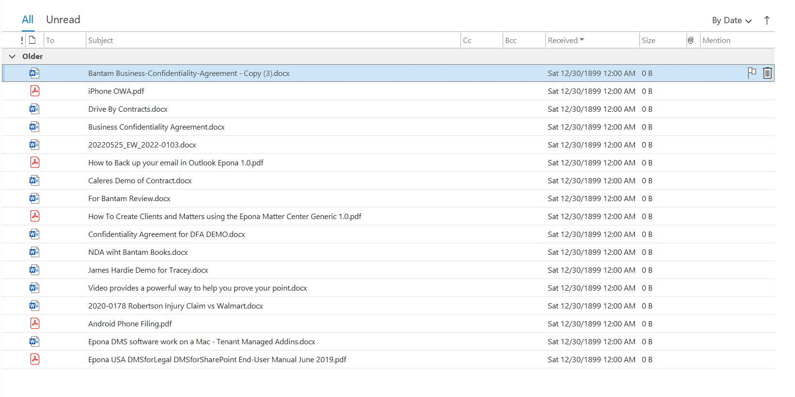

# Troubleshooting FAQ

> These are some of the more common questions and answers when troubleshooting issues in the DMS client.*

## Why can I not see the '_My Matters' in the folder tree on the left?

1. SharePoint Site NOT Configured
1. Authentication Issue - Reset User's Authentication
   1. In Outlook, Select the "DMSfor_____" Tab
   1. Click the "Options" Button
        
   1. Click the "Cear Cache + Auth. Cookies" Button
      
   1. Click "OK"

## How do I configure a connection to the DMS?

1. In Outlook, Select the "DMSfor_____" Tab
1. Click the **Options** Button
   
1. Click the **New** Button in the 'Sharepoint sites' Tab
1. Select the **Active** Checkbox
1. Type a 'Friendly' **Name** *(This is only seen here.)*
   
1. Select the Desired **Authentication** Method
    *(See [Authentication Methods](./AuthenticationMethods.md) for More Information)*
   
1. Type the full URL to the DMS in the **Site (URL)** Field
    *(This value is case-sensitive.  Please be certain to request this information from Epona if necessary.)*
1. Type the Required Values for the Specific Authentication Method
   1. **User name** - Required for All
   1. **Application ID** - Required for "Modern Authentication"
1. The **Configuration** setting is automatically applied as 'Default'.
    *(Additional configurations are only present in custom designs.  Epona will inform the client in these situations.)*
1. Do Not Select the "Use Cache" Checkbox
    *(This is only used for low-latency connections or offline instances.)*

## Why do I see 1899 dates for documents or cannot see any files in my DMS folder in Outlook?

### Examples of Issue

- 1899 Dates
 

- No documents visisble in DMS Folder

### Fix #1 - Turn off 'Conversation View' in Outlook

1. In Outlook, navigate to the **View** Tab
1. If selected, uncheck the **Show as Conversation** checkbox

### Fix #2 - Clear Registry DMS View Settings

1. Close Outlook>
1. In the **Registry Editor**, navigate to:
`Computer\HKEY_CURRENT_USER\Software\Epona\DMSforLegal\FolderViews`
or
`Computer\HKEY_CURRENT_USER\Software\Epona\DMSforOffice\FolderViews`

1. Delete all entries in this location, with the exception of (Default)
   
1. Restart Outlook

## Why are my document tags not sorted alphabetically?

1. Close Outlook, Word, Excel (all Office applications)
1. In File Explorer, navigate to:
`%appdata%\Epona\DMSforLegal\Cache\TermSets`
or
`%appdata%\Epona\DMSforOffice\Cache\TermSets`
1. Delete all items in this location

## I accidentally deleted a file or folder, can you please help me restore it?

1. In SharePoint, open the Matter/Workspace site in which the user accidentally deleted the file or folder.
1. On the left pane of the SharePoint site, select **Recycle Bin**

1. In the Recycle Bin, locate and select the accidentally deleted file or folder.
1. Select **Restore** from the top Ribbon.

## I cannot open the latest version of the document I'm co-authoring

Note: In this fix, steps will be covered to fix versioning issues with a Word Document. These steps are also applicable for Excel and PowerPoint documents.

1. In Word, navigate to `File > Options`
1. In `Word Options > Save`, check that **AutoSave files stored in the Cloud by default in Word** is enabled.

1. In `Word Options > Trust Center`, check that the setting **Store random numbers to improve Combine accuracy** is enabled.

## I do not see DMSforOffice/DMSforLegal in my Outlook/Word/Excel/PowerPoint

1. In the Office application that is missing DMSforLegal/DMSforOffice, navigate to `File > Options > Add-ins`.
1. Select the dropdown next to **Manage** and select **Disabled Items**. Verify that the Epona DMSClient is not in the Disabled items list. If it is, select it from the list and then choose **enable**.

1. Next, back in `File > Options > Add-ins`, change the dropdown next to **Manage** back to **COM Add-ins** and select **Go...**.

1. Check the Epona DMSClient Office Integration is checked in the COM Add-ins list.

1. Restart the Office application you made these changes for.

## My Outlook DMS Filing Bar is being cropped or not appearing correctly

1. In Outlook, navigate to `File > Options`
1. Change the setting for *When using multipe displays* to **Optimize for compatability**

1. Restart Outlook

## How do I export a full list of all Matters/Workspaces or Clients/Categories?

1. Navigate to the DMS landing page
1. Navigate to `Settings > Site Contents`

1. From the Site Contents items, select either the list Matters *(for matters/workspaces)* or Clients *(for clients/categories)*

1. Once the desired SharePoint list is opened, selct the **Export** option in the top ribbon.
   - **Export to CSV**: This will export a static .csv of all list items.
 Note: if your DMS Matter/Workspace list contains folders, it an Export to Excel is recommended.
   - **Export to Excel**: This will export a live query excel file and will require a sign-in. This export method allows for data refreshing and works better with lists that contain folders.
   

## Items to Escalate to Epona

### Corrupt Site Collection

1. Why do I see incorrect columns in my Workspace/Matter?
1. I do not see my metadata when uploading a document?
1. My DMS emails don't appear correctly in Outlook.

### Provisioning Issues

1. I created this matter/workspace and I still cannot access it
1. My documents do not have an assigned Doc ID
1. This matter/workspace did not create with the correct folder structure.

### How to fully delete a Matter/Workspace

1. I accidentally created a duplicate matter/workspace
1. I didn't mean to create a matter/workspace

### Permissions

1. Why can I not access access this matter/workspace I should have permission to?
1. Why can I not subscribe to this matter/workspace I should have permissions to?
