# Configuration

Use the DMS Config application to configure the DMS 365 webpart.

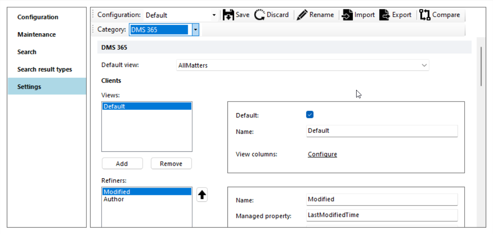

For each panel/view the columns and refiners can be configured. Click on *Initialize with default settings* to create default settings, that can be modified after they are created.

## Sidebar

The left navigation bar can be configured. Specify max 2 levels. The top level will only be rendered if there are subitems.

Use the localized keys to automatically translate the terms inside the Title and Tooltip.

Currently two types are supported. Based on the url the correct type will be configured.

- list
- iframe

To configure an iframe, specify an URL that will be rendered. If it's a relative url, the current sharepoint url will be automatically added.

To configure a list, use the following format *list=view* with the fixed view names: mydocuments, recentdocuments, mymattersdocuments, mymatters, recentmatters, allmatters, allclients, allcontracts.

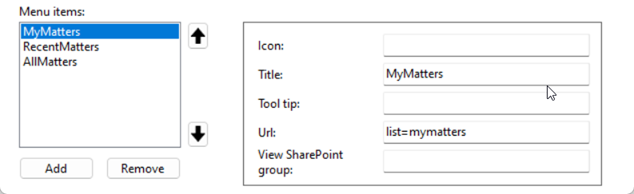

*Icon*\
Specify the name of the icon. Possible values can be found [here](https://uifabricicons.azurewebsites.net/).

*Tooltip*\
Specify the tooltip

*View Sharepoint Group*
Specify the name of the sharepoint group. If the current user is member of this group, the item will be visible. Use sharepoint groups from the sitecollection where DMSFL is installed.

## Search

The Epona DMS 365 app uses search to show all information from Sharepoint. By default there are no managed properties configured to return additional columns from the Matter List. Open the DMS Configu tool, click on Search and add the missing columns from the Matters List. This will take max 24 hours before the columns are crawled by Sharepoint.

## Caching

The settings for Epona365 are stored in the application storage of the browser. A background process will remove obsolete settings when the settings are too old.

Most of the settings are automatically refreshed after a change. In some cases a duplicate reload of the app (browser) is necessary to have the latest settings.

## Columns

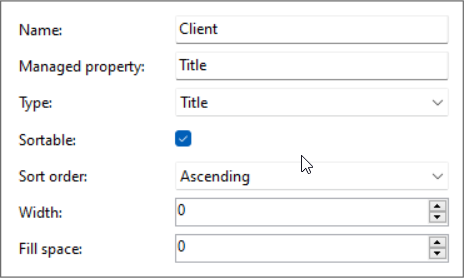

- Name\
Specify the column label
- Managed property\
Specify the name of the managed search property
- Type\
Title => the shortcut icon menu is shown. The column width will always auto-expand\
Date => only the date part will be rendered\
DateTime => the date value will be rendered with relative labels (like 2 hours ago)\
Size => the value will be rendered with relative labels (like 1mb)
Teams => a team icon will be rendered if value is true
HasAttachment => a paperclip will be rendered if true
Importance => an importance icon will be rendered
To => rendered value has a fallback to managed property DMSSMTPTo / DMSTo
- Sortable\
Specify if the property is searchable
- Sort order\
Specify the default sort order
- Width\
Only specify a value (> 0) if the column should have a fixed width

- Fill space\
Only specif a value (>0) if the columns should use all the available width (expand). If more columns have a value the width is spread over the columns with the relative value. If the first column has a value 1 and the second has a value of 2. The total width is divided by 3 and relatively spread over the two columns as configured.

## Refiners

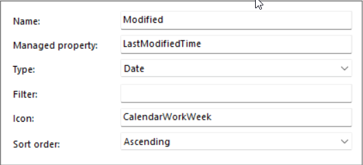

- Name\
Specify the refiner label
- Managed property\
Specify the name of the managed search property
- Type\
Single select => only one refiner can be selected\
Multiple select => one or more refinders can be selected and are used in the search with an OR statement\
Date => pre-defined date values can be selected\
User => one ore more users can be selected. The items are rendered with an user image based on possible hit on email address
- Filter\
See the [Microsoft Documentation](https://docs.microsoft.com/en-us/sharepoint/dev/general-development/query-refinement-in-sharepoint) for possible values.
- Icon\
Specity the name of the icon. Possible values can be found [here](https://uifabricicons.azurewebsites.net/).
- Sort order\
If a descending order is specified and a filter specified, the sort is descending based on the frequency.

## Clients

Currently one view is supported. Specify which columns and refiners should be visible.

## Matters

Currently one view is supported. Specify which columns and refiners should be visible. If the *MatterName* column is used in the MatterList, use that field as Title field. Sorting is not possible on the Title field.

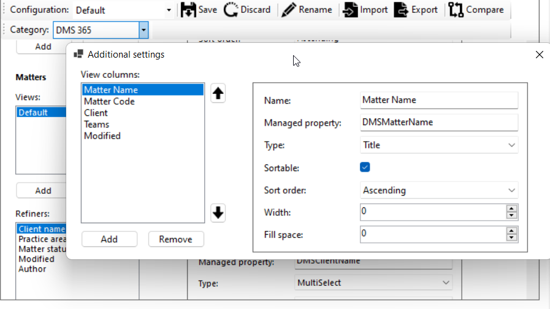

## ContentTypes

When a document list is shown, the contenttype that is defined as default will be shown. In the Matter view the ClientName and MatterName columns will be automatically removed.

Add the email content type (DMS Email) to specify the columns and refiners when an email view should be used. The email view is activated based on the foldername, specified in the DMS Config section.

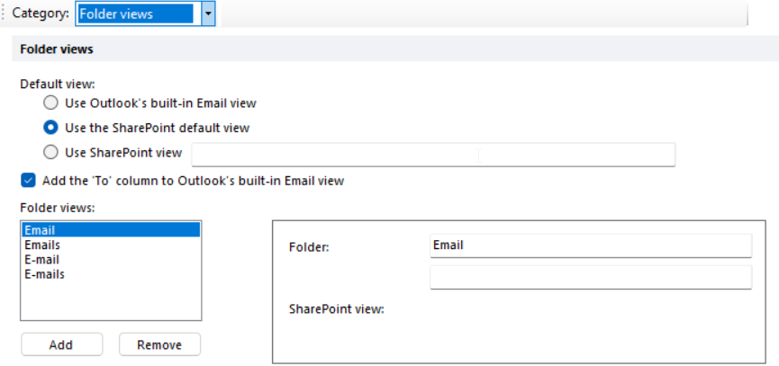

## DMS Config

The following settings that are set via the DMS Config tool are also used in Epona365.

### License

Copy the Client Name and Activation code from the [SLM Portal](https://slmportal.epona.com) when registering the product *DMSfor365* and register/activate the license.
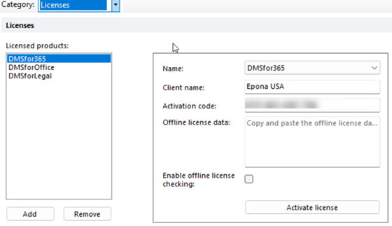

For every user that uses the application a license is automatically registered each time the application is started.

### Outlook

- Create Client/Matter\
If enabled, the create client/matter button is visible. If no url is specified, the default URL is used (/Lists/Matters/NewForm.aspx?IsDlg=1)
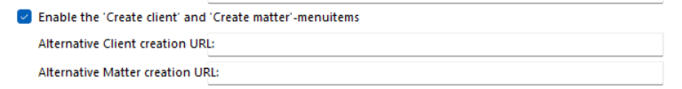

### Advanced search

- Search sitecollection\
If no url is specified, the dmsforlegal sitecollection is used. Make search a subsite Search is available.
- Query text addendum

### Default ContentTypes

- File extension **msg**\
The content types specified are used for the DMS E-mail view.

### Views

- Folder views\
The DMS E-mail view is used when the name of the folder contains one of the specified foldernames.

### Notebooks

The notebooks settings are used in EponaDMS365

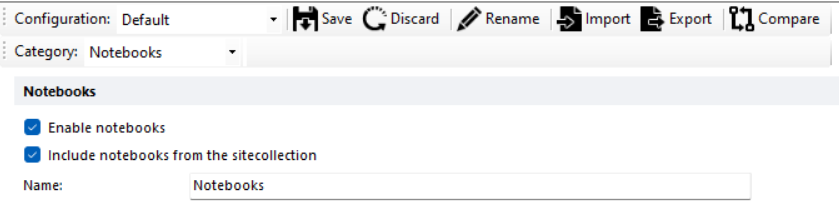

### Terms

The *Client* and *Matter* terms can be renamed via the DMS Config.
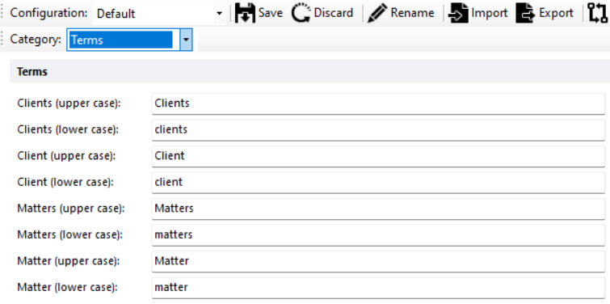

### Contracts

The *Contracts* module is active in Epona365 if the main Contracts Document library url is specified. Only this model is currently supported. Also specify the name of the content type and configure the columns for that ContentType in the Epona365 contenttype sections

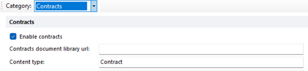
