# Installation

> Currently the URL column in the matterlist should contain an url pointing to a document library (not a site/sitecollection). Multi doclib design is not supported.

## Requirements

*ClientCode*\
The Client:Code column should exist in the Matters list.

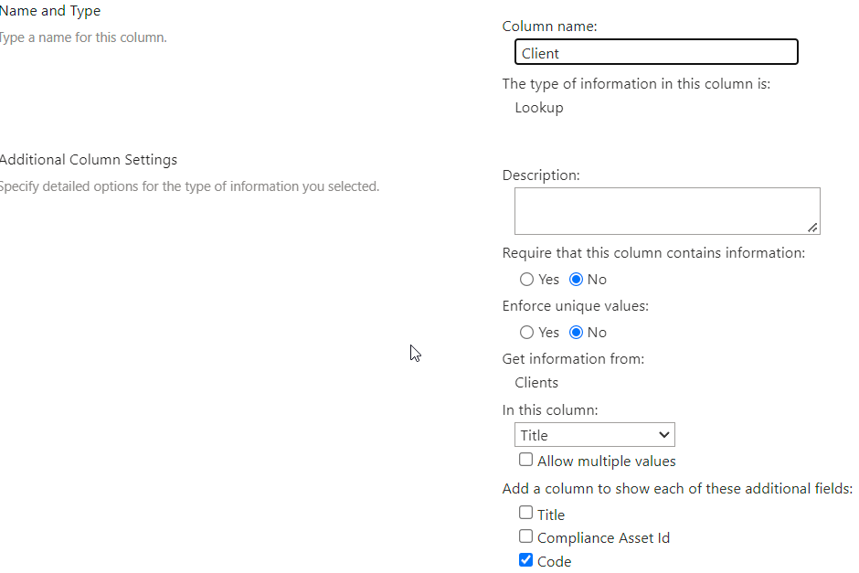

The Client:Code column should be added to the managed property DMSClientCode manually if not created via DMS Config tool.
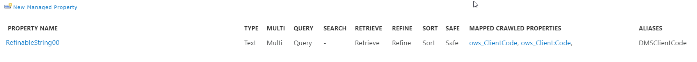

*MatterName*\
The MatterName column should exist in the Matters list. Add the matter name value to the column via the filehandlers matterslist.xlsx.

## App Catalog Installation

The webpart can be deployed as a tenant wide solution or single site collection. Tenant admin permissions are required to install and deploy the app to the tenant. If only site collection administrator permissions are available, install and deploy the webpart to a single sitecolletion.

### Tenant App Catalog Installation

Follow these steps to install the EponaDMS365 webpart solution as a tenant wide solution. Tenant admin permissions are required.

- Install the package (sppkg) into the Sharepoint AppCatalog
- Open the [App Catalog Admin page](https://tenant-admin.sharepoint.com/_layouts/15/online/TenantAdminApps.aspx) in the browser and click on *App Catalog*.\
To create a new AppCatalog site open the [Tenant AppCatalog configuration](https://tenant-admin.sharepoint.com/_layouts/15/online/TenantAdminApps.aspx).\
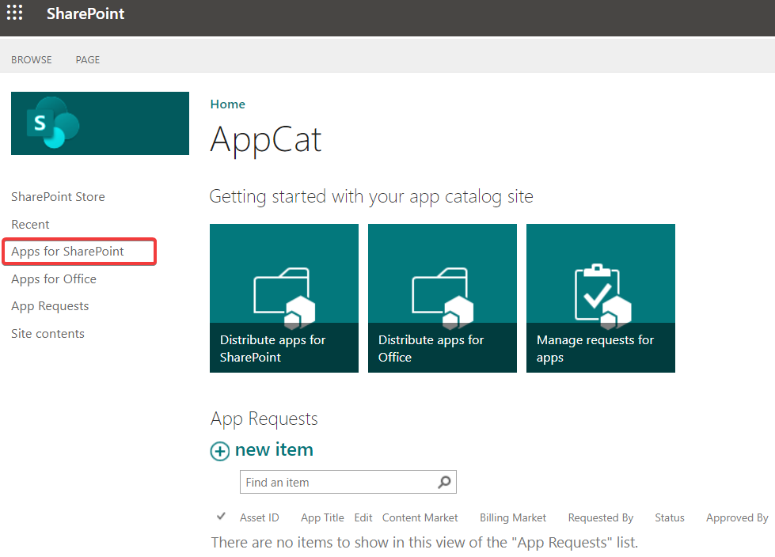

- Select *Apps for Sharepoint* and drag/drop the file EponaDMS365.sppkg into the list.\
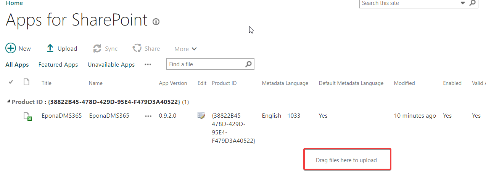
- Enable the option *Make this solution available to all sites* and click on *Deploy*\
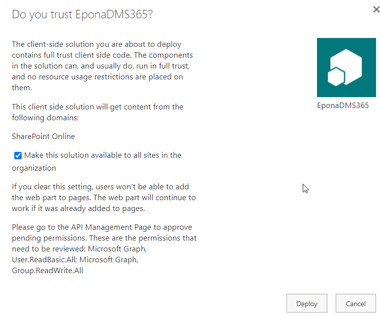

The application is installed and deployed.\
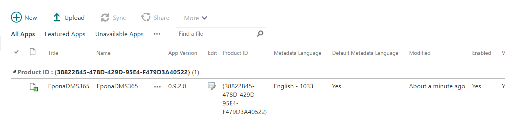

### SiteCollection App Catalog Installation

Follow these steps to install the EponaDMS365 webpart solution in a single sitecollection. Site collection admin permissions are required. The tenant wide webpart version is ignored (if installed)

> This option can also be used to test a new version.

The target sitecollection should be configured as an 'App Catalog' sitecollection using the following powershell

```Powershell
Connect-SPOService -Url https://<tenant>-admin.sharepoint.com
# create site collection app catalog
Add-SPOSiteCollectionAppCatalog -Site https://<tenant>.sharepoint.com/sites/epona
```

For more information see [docs.microsoft.com](https://docs.microsoft.com/en-us/sharepoint/dev/general-development/site-collection-app-catalog)

When the app catalog is enabled in the sitecollection:

- browse to the url `https://tenant.sharepoint.com/sites/epona/appcatalog`
- install/deploy the webpart, see [Tenant installation](#tenant-app-catalog-installation)

## API Access

After installation approve the MS Graph API permissions, via `https://tenant-admin.sharepoint.com/_layouts/15/online/AdminHome.aspx#/webApiPermissionManagement`.

Azure ActiveDirectory admin permissions are required to assign the API permissions.

Delegated permissions are used to access the resources in Sharepoint. The effective permissions are the intersection of the delegated permissions the app has been granted (via consent) and the privileges of the currently signed-in user. Your app can never have more privileges than the signed-in user.
See [Delegated and Application Permissions](https://docs.microsoft.com/en-us/graph/auth/auth-concepts#delegated-and-application-permissions).

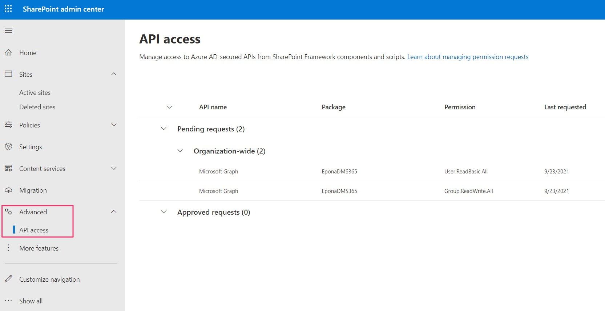

## Microsoft Teams App Catalog

The App can be deployed as an Personal Teams app to Microsoft Teams.

To make the webpart available in MS Teams, open the [Manage Apps in the Teams Admin](https://admin.teams.microsoft.com/policies/manage-apps).

- Select the *Upload* button
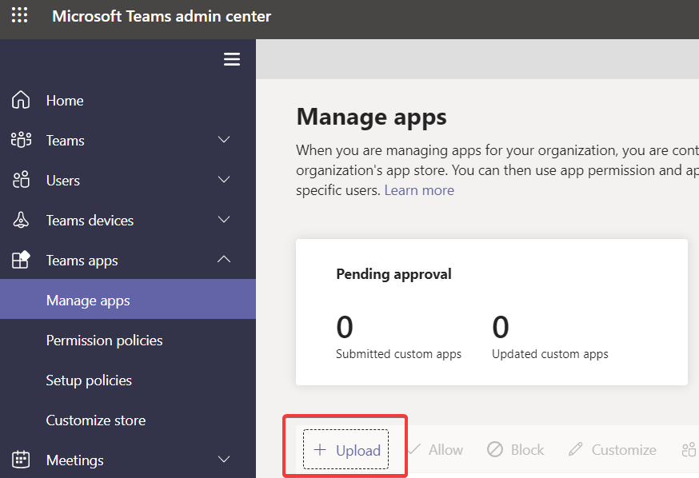
- Select to the *Epona365.zip* file.
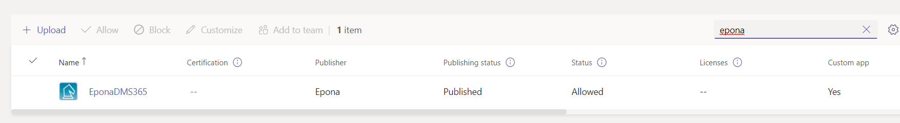

>If DMSforLegal is deployed to a sub sitecollection (not the root), manual update the manifest.json file in the *Epona365.zip* file.
>
> To use a different sitecollection url (for example /site/eponadms), follow these steps:
>
>- extract the files in the zip file
>- open the manifest.json file in a text editor
>- update the **dest=** part of *contentUrl* in the staticTabs sections to contain the correct url
dest=**/sites/eponadms/**_layouts/15/teamshostedapp.aspx
>- update the **dest=** part of *configurationUrl* in the configurableTabs sections to contain the correct url
dest=**/sites/eponadms/**_layouts/15/teamshostedapp.aspx
>- Save the manifest.json file
>- Update the zip file with update manifest.json file (zip file should NOT contain a subfolder)

## Remove app from Teams App Catalog

To remove the app from the [Manage Apps in the Teams Adming](https://admin.teams.microsoft.com/policies/manage-apps), click on the app. At the app details page, click on the three dots, Actions, Delete

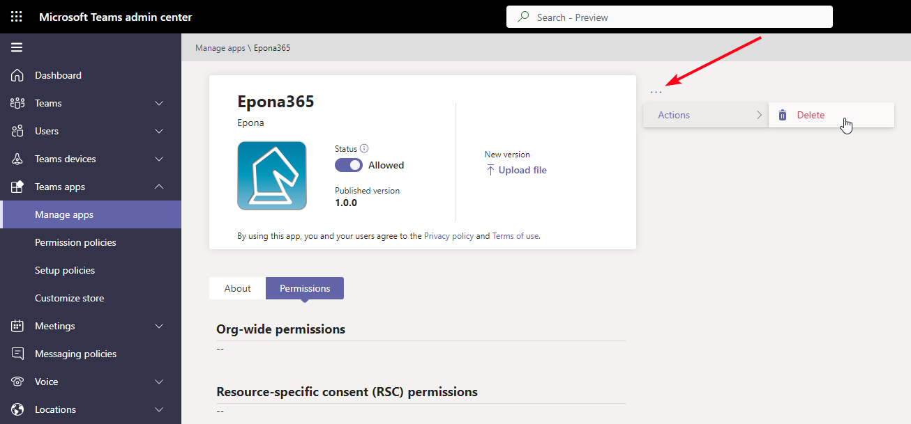

## Microsoft Teams Client Installation

Install the Epona365 app in the Microsoft Teams client or website.

- Open Microsoft Teams and click on the Dots icon to install the app, Search for Epona, Select the EponaDMS365 app\
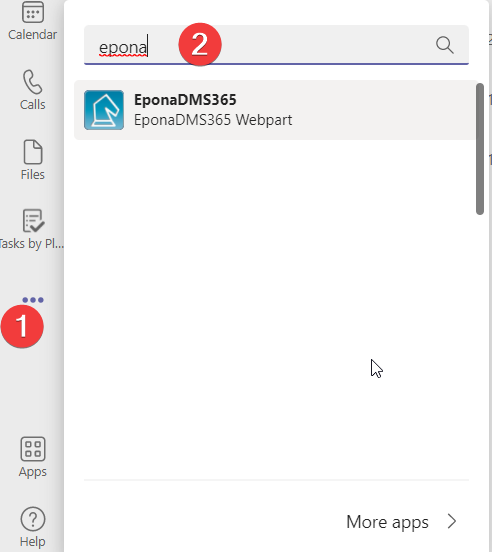
- Click on *Add*. The app is added and can be pinned to the left navigation bar by right clicking on the app and select Pin\
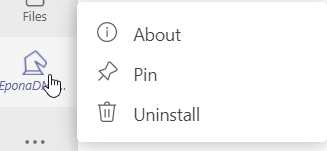

## Update existing installation

To update an existing installation, follow these steps.

- Open the App Catalog
- Select *Apps for Sharepoint* and drag/drop the file EponaDMS365.sppkg into the list and confirm with *Replace it*. Ena
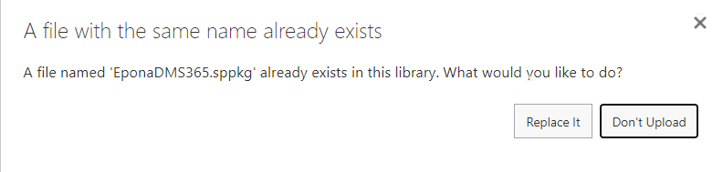
- Enable the option *Make this solution available to all sites* and click on *Deploy*\
- Refresh the Microsoft Teams app or webpage to use the updated version

No changes are necessary in the Microsoft Teams app catalog.

## Sharepoint Fullpage App

Create a new SitePage, named Epona365.aspx and add the EponaDMS365 webpart to the page.

Modify the permissions of the new page (via Site Pages, Manage Access) and give Users Read permissions.

User PnP.Powershell to update the layout of the page to a single webpart page.

```powershell
Connect-PnPOnline -Url https://contoso.sharepoint.com/sites/epona
Set-PnPPage -Identity "<pagename>" -LayoutType SingleWebPartAppPage
```

Disable the quick launch navigation elements via the Site Settings.

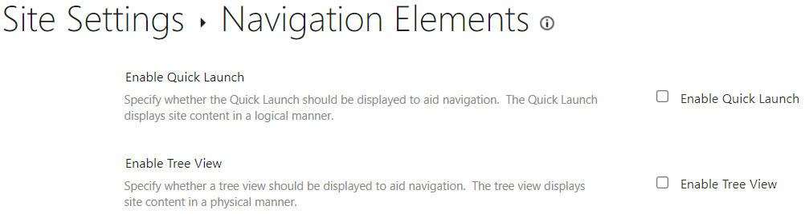

It's also possible to create a link without a page to show the Epona DMS365 app in a full page.

/_layouts/15/apppagehost.aspx?componentId=65a87007-ac17-41b6-ace1-b1755acd42f3

## Sharepoint Search box

Use the pnp [Set-PnPSearchSettings](https://pnp.github.io/powershell/cmdlets/Set-PnPSearchSettings.html) commandlet to hide the search bar in Sharepoint (for the current sitecollection or web (subsite)).

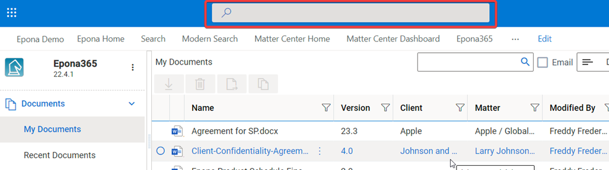
