# Case Manager Configuration Center

Before setting-up the Case Manager environment you need to create a new
site on your SharePoint environment and assign the appropriate
user/group permissions to the newly created site. How to create a
SharePoint site is not covered in this document.

After the site is created, we need to initialize the Case Manager
environment. To do this, start the CaseManagerConfig.exe application.
The Case Manager Configuration Center provides a couple of maintenance
function that apply to the Case Manager environment.

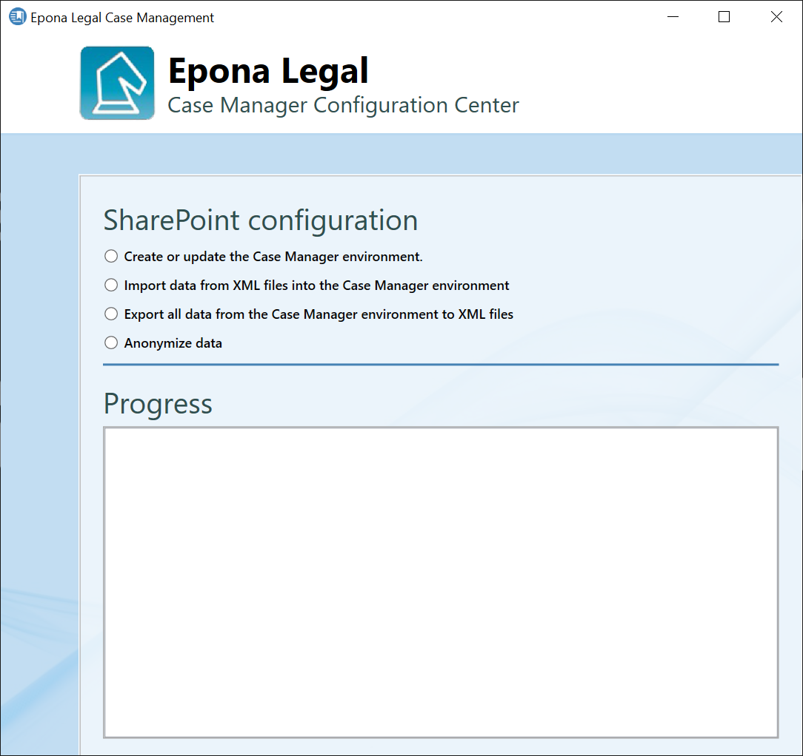

## Create and initialize the Case Manager environment

To create the necessary lists in SharePoint and initialize the Case
Manager environment, select **Create or update the Case Manager
environment** option.

Enter the URL of the SharePoint site you created and select the type of
authentication you want to use to access this site. Depending on the
authentication type you selected, enter the required field (e.g.
username and password).

If you need to re-initialize an existing Case Manager environment, check
the **Remove all SharePoint lists** option. This option will remove all
existing SharePoint lists from the Case Manager environment.

**WARNING:** this option also removes all existing data from the
SharePoint site.

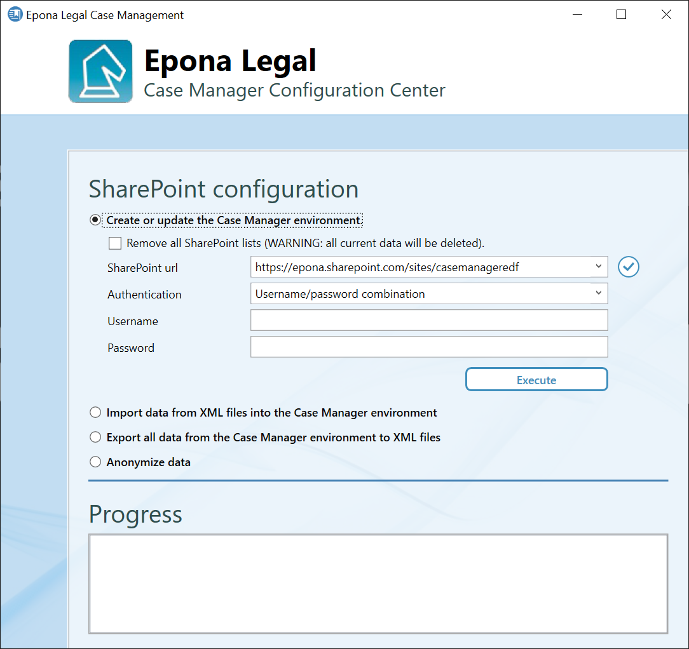

To check you credentials click on the check button on the right side of
the **SharePoint URL** field. The application will check if the
credentials you entered are correct and if a connection to the given
SharePoint site can be established.

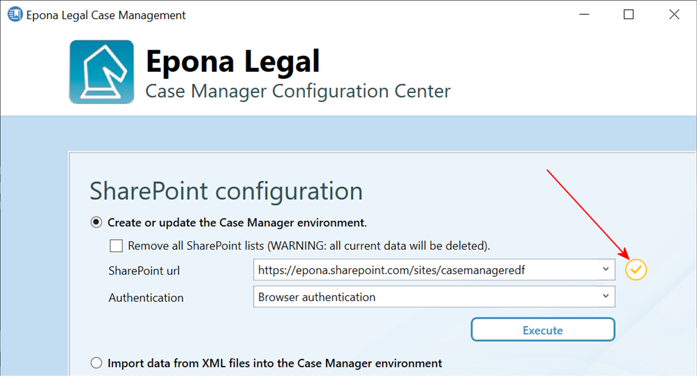

If the connection fails to initialize, the following dialog box will be
shown.

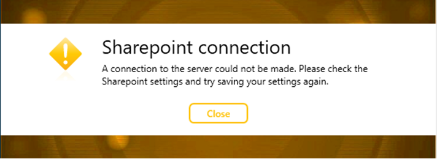

If the application is able to establish a connect to the SharePoint site
the following dialog box is shown.

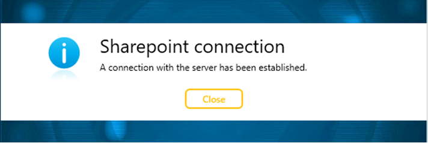

When the connection to the SharePoint environment is establish, click on
the **Execute** button, to create the required lists and initialize the
Case Manager environment. The progress of the creation/update process is
shown in the **Progress** section on the bottom.

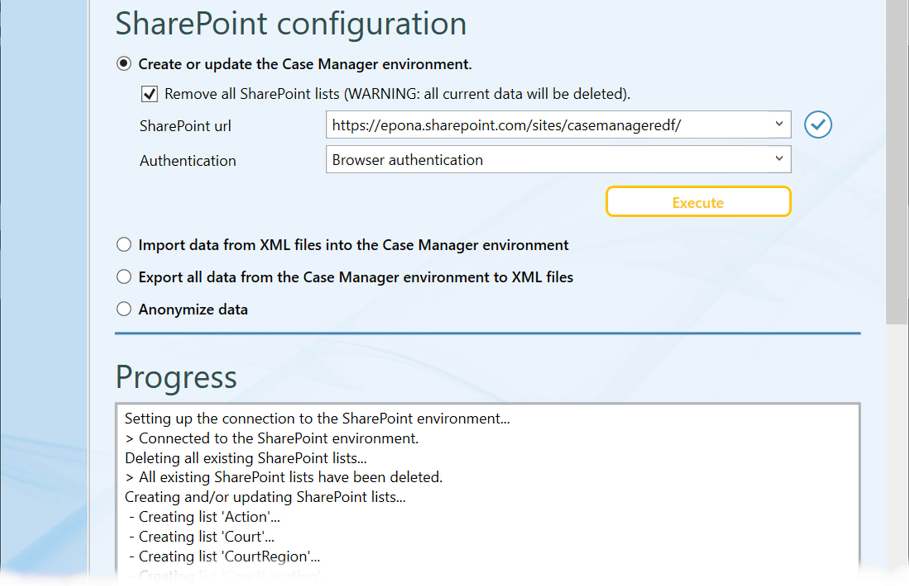

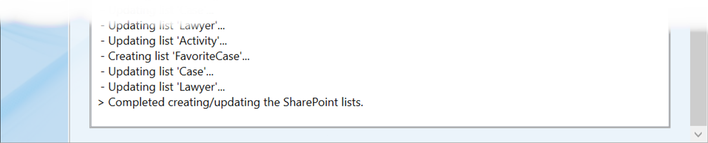

After the creation process has finished the Case Manager environment is
ready for use. The Case Manager environment contains a default
Administrator user. This user has full control over the environment and
can be used to add additional users/lawyer to the system.

## Importing XML files into an existing Case Manager environment

It is possible to import predefined data (e.g. lawyers, jurisdictions
etc.) into a clean Case Manager environment by means of XML files. To
import data select the **Import data from XML files into the Case
Manager environment** option.

Select the desired SharePoint site and check the connection if
necessary. Select the location where the XML data files reside by
clicking on the browse button to the right of the **Import files
location** field. All XML files that are in the file location will be
shown in a list box. By default all files are selected for import, but
you can uncheck the files/entities you do not need. Click on the
**Import** button to start the import process. The progress of the
import will be shown in the **Progress** section. Depending on the
amount of data, the import process may take a long time.

**NOTE**: some files/entities depend on other files/entities. When
selecting an entity that depends on another, the required entities will
automatically be selected.

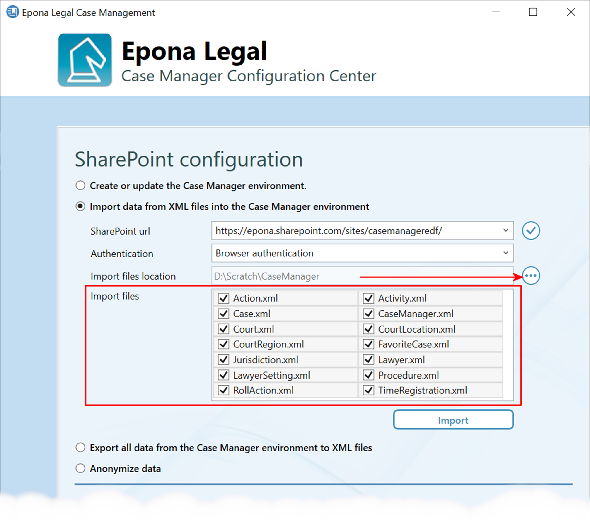

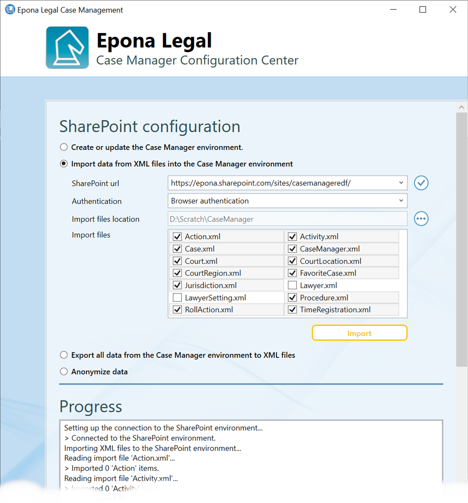

## Export existing Case Manager data

You can export all existing data from an existing Case Manager
environment to XML files. These files can be used to migrate existing
data to a different SharePoint location. To export the Case Manager data
select the **Export all data from the Case Manager environment to XML
files** option.

If u want to use the exported files to migrate data to a different
SharePoint environment, select the **Use SharePoint field names**
checkbox. This ensures that the fieldnames used for exporting the data
can be read by the import process.

Select the desired SharePoint site and check the connection if
necessary. Select an export location by clicking on the round button to
the right of the **Export location** field. The XML files will be saved
to tis location. Click on the **Export** button to start the export
process. The progress of the export will be shown in the **Progress**
section. Depending on the amount of data this process may take some
time.

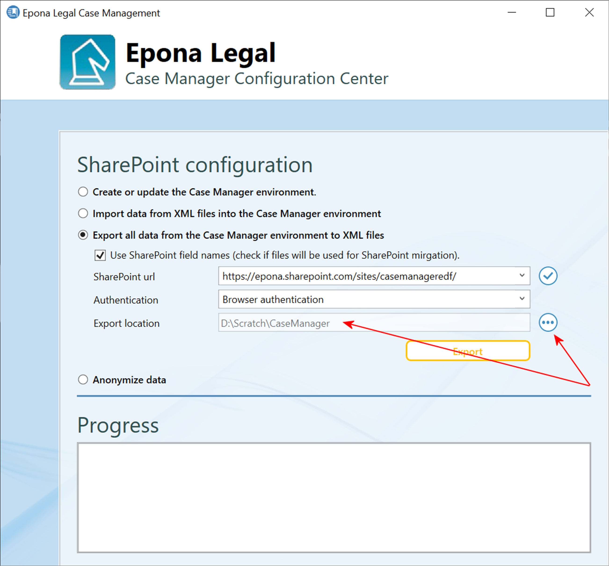

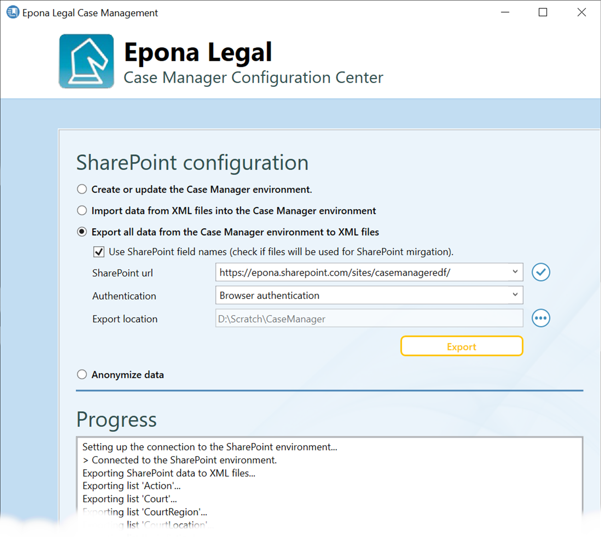

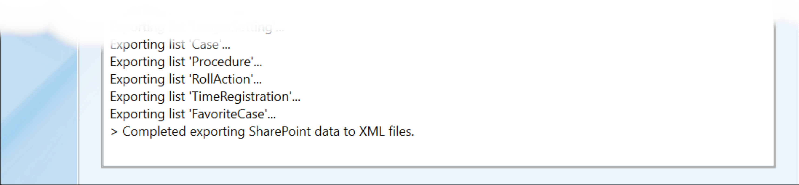

## Anonymize Case Manager data

If you need to anonymize Case Manager data (for example when setting-up
a test- or acceptance environment with production data), you can
anonymize lawyer names, case manager names and matter/case names with
this configuration tool.

Select the **Anonymize data** option and select the entities you wish to
anonymize. Select the desired SharePoint site (check the connection if
necessary) and click on the **Anonymize** button to start the process.
Depending on the amount of data within your Case Manager environment
this process make take some time. The progress of the anonymization
process is shown in the **Progress** section.

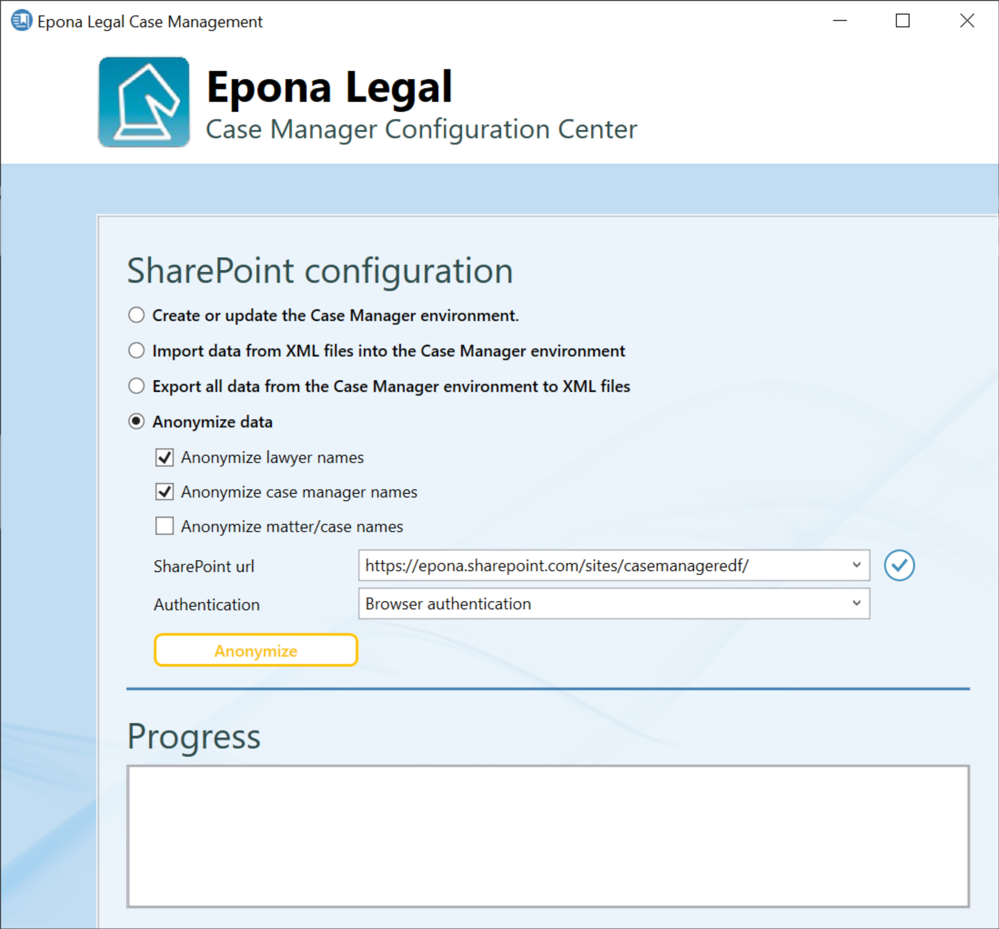
