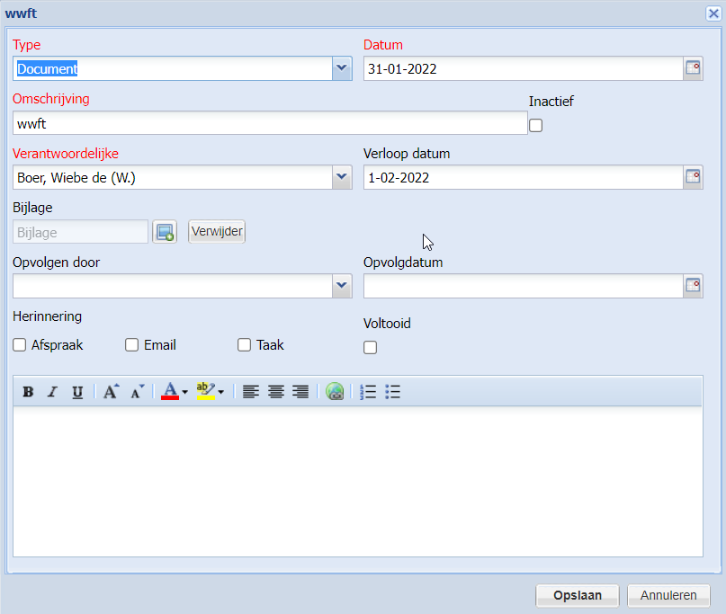
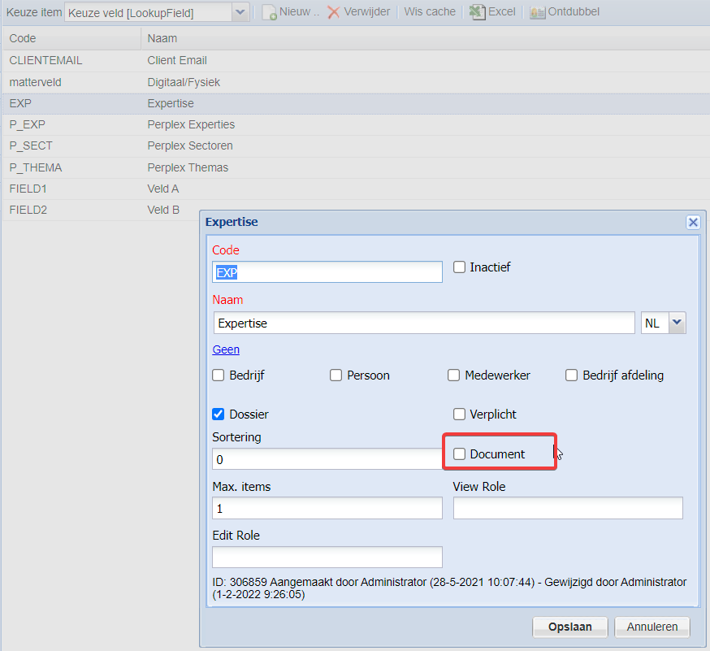

# Documents

One or more documents can be linked to a contact or to a matter. Each document can have an optional expiredate. The owner will get an email when the document is expired. Mark the document as inactive to disable the reminder.



Create one or more activity types that can be selected. The activitytype code should contain the prefix DOCUMENT.

Custom fields can be made visible on the document form.



To rename the tab in the Details contact card, create or update the file \\Config\\Localize\\Xtensive.Cms.UI.nl.ini and add the content:

```ini
[Actions]
TabDocuments=Docs
```

## Configuration

- ContactVisible\
Specify the type of contact where the documents tab should be visible
- ContactCreateRole\
Only members of the specified role can add new documents  linked to a contact.
- MatterVisible\
Specify if documents tab should be visible on matters.
- MatterCreateRole\
Only members of the specified role can add new documents linked to a matter
- ShowAttachmentUpload\
If enabled, the user can upload a file to CM. The file is stored in the CM sql database
- ShowDocumentUrl\
If enabled, the user can specify a link to a document.
- SendReminderForExpiredDocumentsInDays\
If enabled send a reminder via email to the owner X days in advance. Specify -1 to disable the reminder.
