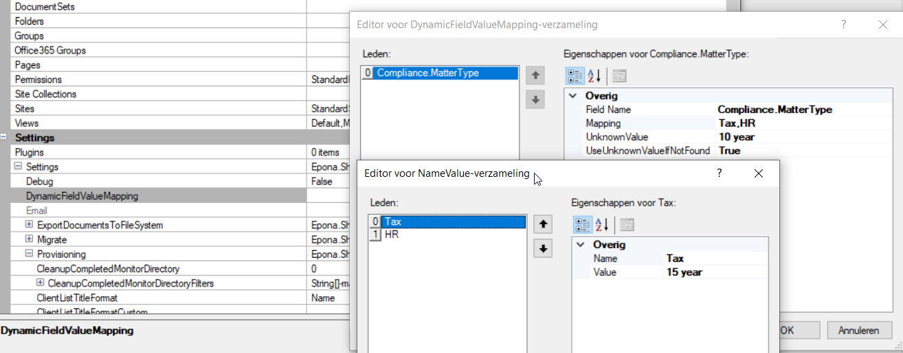

# Update Doclib Compliance Tag

Use this format to update the compliance tag in a document library. The filename should contain *DoclibComplianceTag* and format is xls(x)

The following columns are required:

- Url (optional)

- ClientCode (optional)

- MatterCode (optional)

- Label

- BlockForEdit

- BlockForDelete

- ApplyToExistingItems

If *Url* is empty, the *MatterCode* is required.

If *ApplyToExistingItems* is enabled, the existing files will be updated with the new label.

Use the prefix *Compliance* to specify a replace value. For example:

