# Application registration in Azure

Login to [https://portal.azure.com](https://portal.azure.com/)

- Go to Azure Active Directory
- Go to App registration
- Create a "New registration"

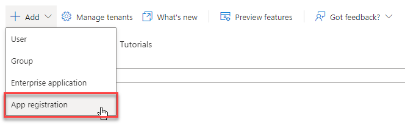

- Enter a name for the application (Epona Site Provisioning)
- Create a Redirect URI (value not relevant)
- Click "Register"

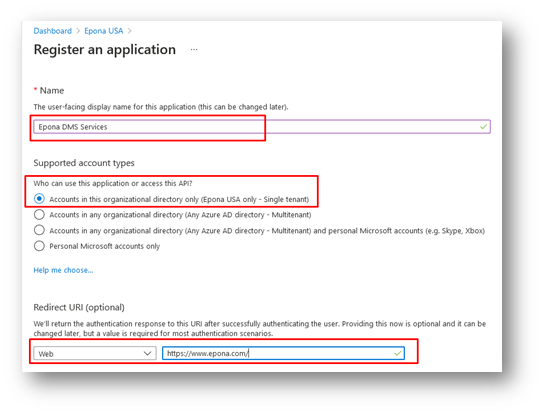

- **! Save the Application (client) ID !**

- Go to API permissions

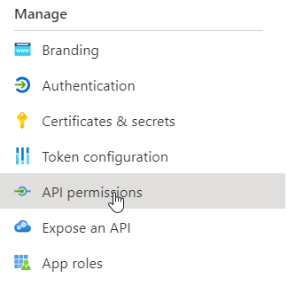

- Click "Microsoft Graph (1)"

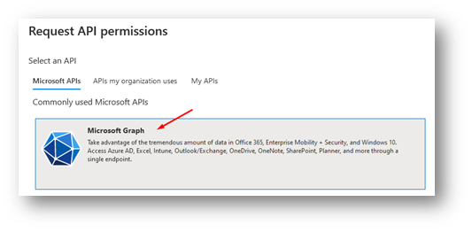

- Click "Delegated permissions"
- Uncheck User.Read

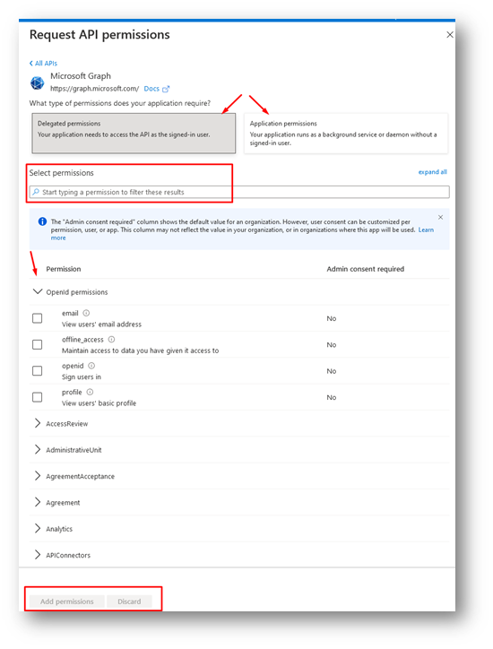

- Click "Application permissions"
  - Group.ReadWrite.All
  - Sites.ReadWrite.All
  - User.Read.All
  - Notes.Read.All

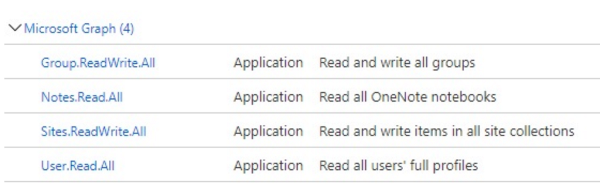

- Click "Add permissions"
- Click on *Grant admin consent* before authenticating the first time !!

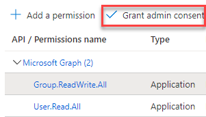

- Go to Certificates & secrets
- Click "+ New client secret"

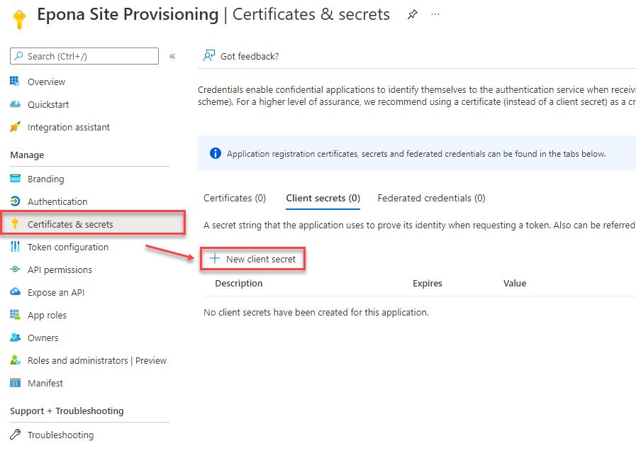

- Fill in a description
- Set Expires to 24 Months
- Click Add

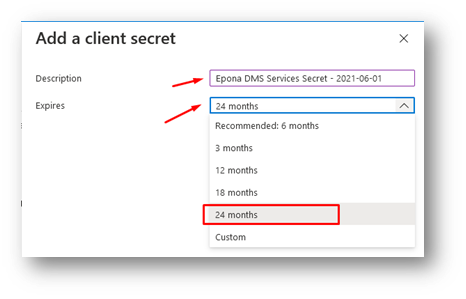

- Write down the client secret Value

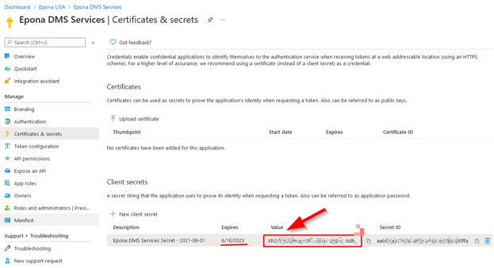

For *Tenant* (site collection design) permissions add the app to the TENANT via <https://TENANT-admin.sharepoint.com/_layouts/15/appinv.aspx>

For *Site Collection* (site/doclib design) permissions add the app at <https://TENANT.sharepoint.com/sites/SITECOLLECTION/_layouts/15/appinv.aspx>
Do this for every site collection the Site Provisioning needs access to!

- Fill in the app id (from step 7) and choose Lookup
- Fill in a domain (value not relevant)
- Fill in the XML with the required permissions:

For full Tenant Access (example [https://eponademo.sharepoint.com](https://eponademo.sharepoint.com/))

~~~html
<AppPermissionRequests AllowAppOnlyPolicy="true">
   <AppPermissionRequest Scope="http://sharepoint/content/tenant" Right="FullControl" />
   <AppPermissionRequest Scope="http://sharepoint/taxonomy" Right="Write" />
</AppPermissionRequests>
~~~

For single Sitecollection Access (example: <https://eponademo.sharepoint.com/sites/DMSFL>)

~~~html
<AppPermissionRequests AllowAppOnlyPolicy="true">
   <AppPermissionRequest Scope="http://sharepoint/content/sitecollection" Right="FullControl" />
   <AppPermissionRequest Scope="http://sharepoint/taxonomy" Right="Write" />
</AppPermissionRequests>
~~~

For migration it's also necessary to allow the app to use Sharepoint Search

~~~html
<AppPermissionRequest Scope="http://sharepoint/search" Right="QueryAsUserIgnoreAppPrincipal" /> 
~~~

- Click Create

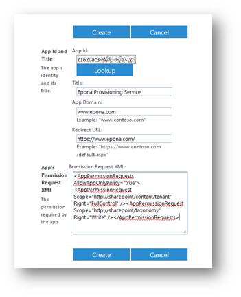

- Click Trust it

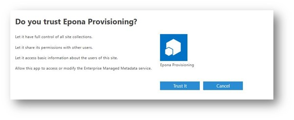

- Check if the app has been added under Site app permissions

- Permissions can be removed with the X

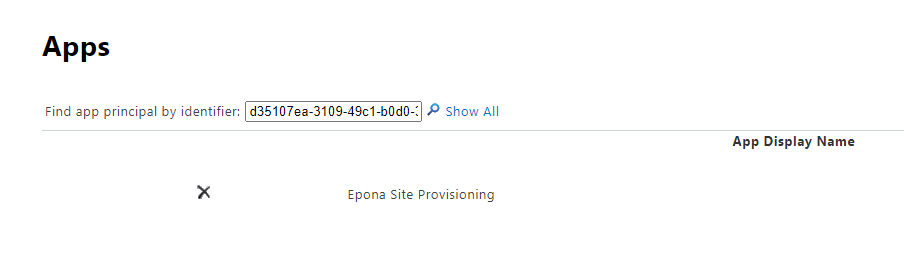

- Fill the application ID (from step 7) in the site provsioning configurator

- Fill the secret (from step 18)

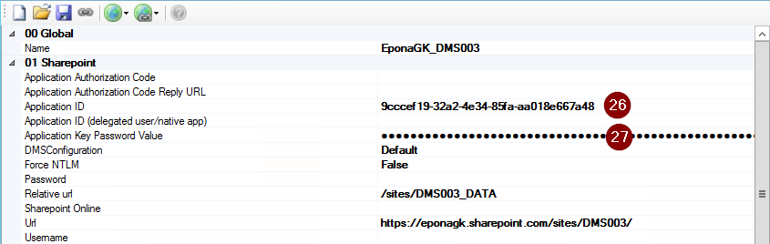

- Configure the site provisioning

Configure the site provisioning without username and password. Check if at least one sitecollection owner is specified in the sitecollection set (if sitecollection are used)

To validate the credentials without our tools use the PnP commandline:

~~~powershell
Connect-PnPOnline -Url https://eponademo.sharepoint.com/sites/epona -ClientId [Your Client ID] -ClientSecret "[Your Client Secret]"
~~~

If the connections returns a 401 error, check the DisableCustomAppAuthentication via Get-SPOTenant  (needs the latest SharePoint Admin PowerShell). If the value is true, disable the setting. It will take a couple of minutes before this change becomes active.

~~~powershell
Set-SPOTenant -DisableCustomAppAuthentication $false
~~~

See [https://docs.microsoft.com/en-us/sharepoint/dev/solution-guidance/security-apponly-azureacs](https://docs.microsoft.com/en-us/sharepoint/dev/solution-guidance/security-apponly-azureacs)
