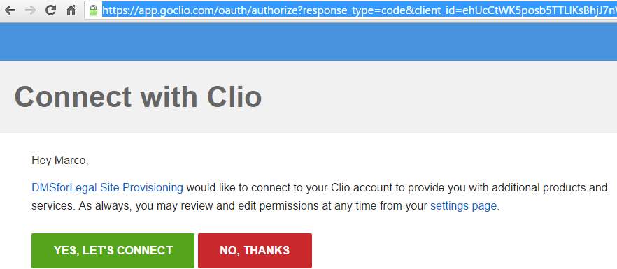
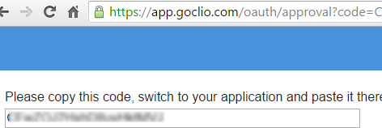

# Clio

This plugin will periodically query the clio application for new and updated matters.

If the customer is hosted by Clio in the EU, change the base url to <https://eu.app.clio.com/> and also use that url to request an token.

Check the Clio documentation for the exact base-url. currently the API is available in four distinct data regions: Australia (au.app.clio.com), Canada (ca.app.clio.com), EU (eu.app.clio.com) and US (app.clio.com). See [Clio Developer site](https://docs.developers.clio.com/api-reference/#section/Getting-Started)

An access token is required. The token can be created via:

- Login into Clio
- Open this url [https://app.clio.com/settings/developer_applications](https://app.clio.com/settings/developer_applications) or [https://eu.app.clio.com/settings/developer_applications](https://eu.app.clio.com/settings/developer_applications) (use the correct base url!)
- Add the application
- Specify for website url [https://www.epona.com/](https://www.epona.com)
-
- Register the redirect url [https://oauth2.eponalegal.com](https://oauth2.eponalegal.com)
- Give the application permissions to Read:
  - Contacts
  - General
  - API
  - Matters
  - Users

- Add the App Key and App Secret to the site provisioning configurator in the Clio configuration part.

- Open this url in the browser, replace APPKEY with the AppKey/ClientId.

[https://app.clio.com/oauth/authorize?response_type=code&client_id=**APPKEY**&redirect_uri=https%3A%2F%2Fapp.clio.com%2Foauth%2Fapproval](https://app.clio.com/oauth/authorize?response_type=code&client_id=APPKEY&redirect_uri=https%3A%2F%2Foauth2.eponalegal.com)

or for the EU

[https://eu.app.clio.com/oauth/authorize?response_type=code&client_id=**APPKEY**>&redirect_uri=https%3A%2F%2Foauth2.eponalegal.com](https://eu.app.clio.com/oauth/authorize?response_type=code&client_id=APPKEY&redirect_uri=https%3A%2F%2Foauth2.eponalegal.com)

- Click on "Yes Let's connect"

- Copy the code to the clipboard and add the code to the Clio Config in the App Code key in the site provisioning configuration.

When a new authorization code is generated always remove the cached file in the \\Config\\Clio\\\<currentsharepointconfig\>.json.

After generating the authorizationcode, the first request should be done very quickly (within minutes), or else the code is not valid anymore.

After the first connection from the site prov. Service an access token is generated and stored in the configuration. Remove this token and regenerate the app_code when unauthorized message is returned.

The mattercode in clio can be configured in many ways. Specify a split character in the MatterCodeSplit config option. The part before the split character will be used as mattercode.

The *Map\** keys in the configuration can be used to optionally specify the sharepoint column name. If empty, the field is skipped.

By default the mattername is filled with the display_number, but set the *MatterNameDescription* to true, to only the description in the mattername.
