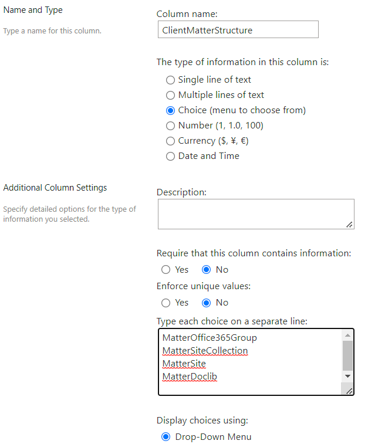
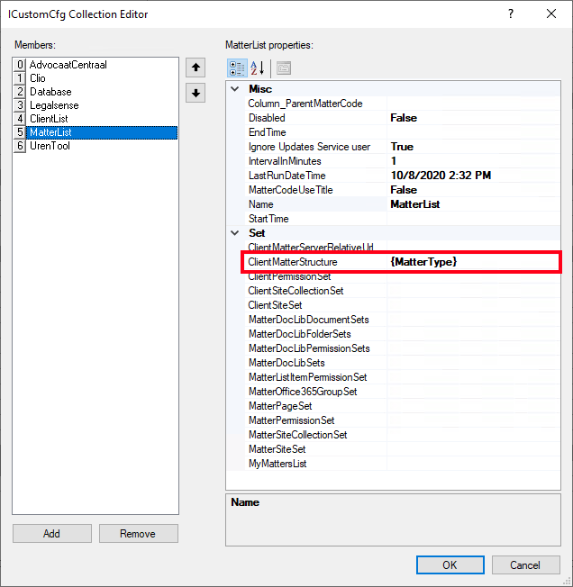
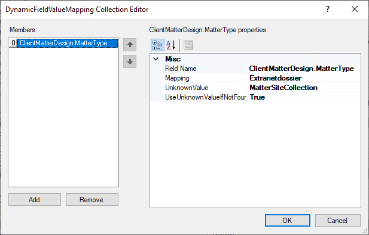

# Dynamic Client Matter Design

Goal: Create a client matter structure based on the mattertype. If mattertype is Extranet use MatterOffice365Group else MatterSiteCollection

Check if the Matters list has a field configured with the name *ClientMatterStructure*. If not create a new choice field and specify the allowed/used designs: (a text field can also be used). If this field is available, it's automatically updated by the site prov. service when provisioning a matter. For existing matters it will use the design that is specified in the column.



Choices can be:\

```text
MatterSiteCollection
MatterSite
MatterDocLib
ClientSiteCollection_MatterSite
ClientSiteCollection_MatterDocLib
ClientSite_MatterSite
ClientSite_MatterDocLib
MatterOffice365Group
```

Configure the field *ClientMatterStructure* in the matterlist (or others) plugin with the dynamic value *{MatterType}*



Create a dynamic fieldmapping in /Settings/DynamicFieldValueMapping

* Create a new items with the fieldname ```*ClientMatterDesign.MatterType* (prefix ClientMatterDesign.<dynamicfieldname>)```
* Add a mapping for *Extranet* and value *MatterOffice365Group*
* Set *UseUnknownValueIfNotFound* to *True* and set *UnknownValue* to *MatterSiteCollection*



Create a mapping for each mattertype that should be converted into one of the possible values of ClientMatterDesign. The unknown value will be used if the mattertype is not configured.
