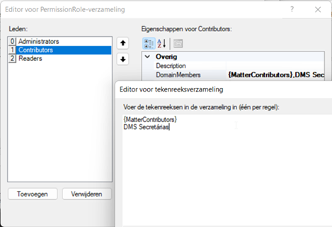
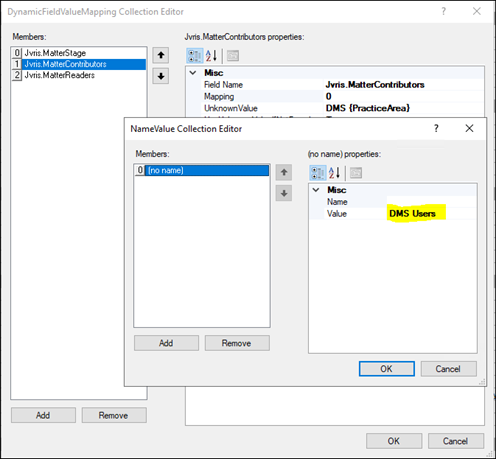
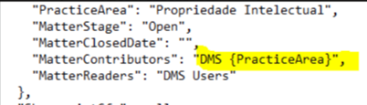

# Dynamic replace value

Permissionset is setup like this, using the variable {MatterContributors}

But the property *MatterContributors* has a configuration to replace the values:

- There’s an empty mapping configured, so if the value is empty use the value DMS Users
- For all other values that are not configured use a value DMS {PracticeArea} (see Unknown value configuration)

When the permissionset is handled via the client matter json this results in a new value DMS Taxlaw (if the value for the variable PracticeArea = Taxlaw)

