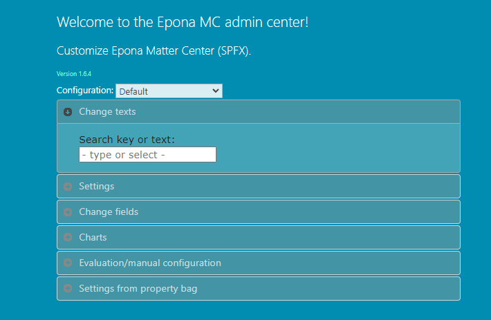
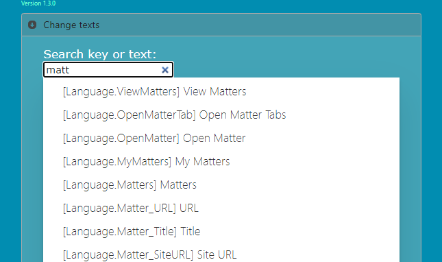
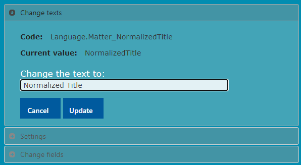
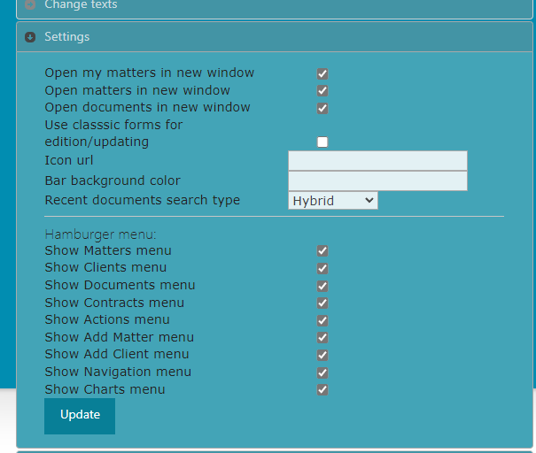
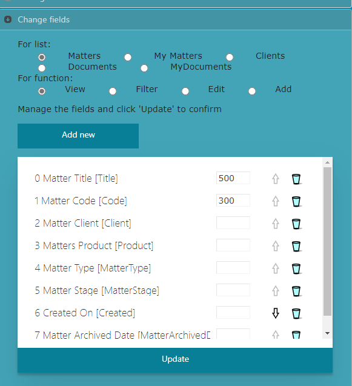
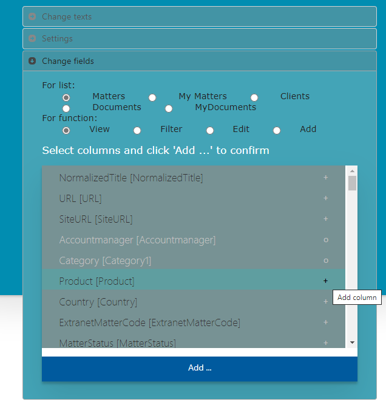
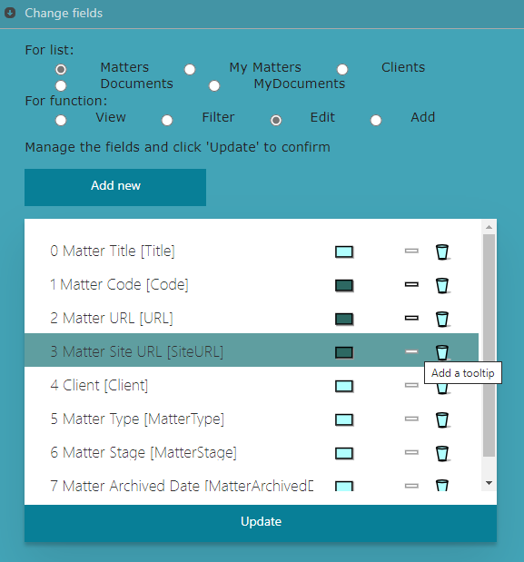
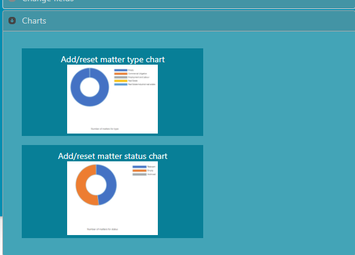
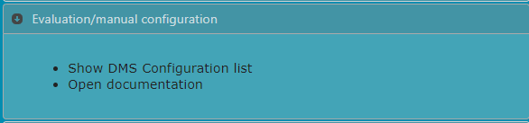
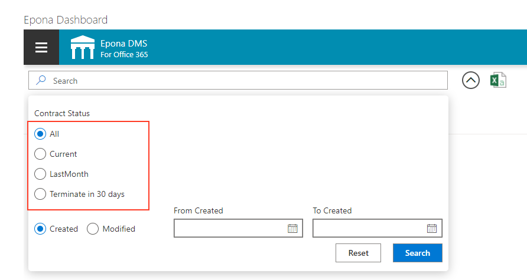

# Epona Matter Center SPFx configuration

Epona MC can be configured by settings in the DMS Configuration SP list. The defaults for all the lists, forms and filters are defined within the app, so it works without additional settings. Only for more specific settings, like the title of the Matter column, the columns that are displayed etc. items can be added to the DMS Configuration list to overrule the default.

## General syntax

Items added for the Epona MC SPFx app should all have 'SPF' in the Category field. The Title field contains the key for the setting. The key constsist, like for the DMSforLegal settings, a more or less hierargical structure of words, each separated by a dot. The value field contains the actual setting, and the desciption is only used as documentation.

## MCAdmin: the app for admins to simplify the configuration

Like EponaMC SPFX, MCAdmin is a modern SharePoint web app that can be installed on any page within the DMSforLegal site collection. To make the app available in SharePoint, the MCAdmin.sppkg file has to be uploaded to the app catalog and deployed.
After that a new SP page should be created (within the DMSforLegal site collection, normally it is created in the SitePages folder and called 'MCAdmin'). If available, the webpartpage is used as template. Then the MCAdmin app is added to this page.

As the app is meant for administratiors, access restrictions can be configured for the page.

### Using the app

The app has several parts that handles different settings for EponaMC:

1-Fixed text elements

2-Common settings

3-List and form field

4-Charts

5-Evaluation/manual configuration

The individual parts are discussed below.

#### Fixed text elements

When typing in the searchfield, the app will show all the text elements where either the key or the text value contains the typed text. This allows an easy way to find the text to be edited.

Once a choice is made the user can change the text that belongs to the key, and press the Update button to save the changes.

#### Common settings

There are a few settings for EponaMC SPFX that can be changed both from the DMS Configuration Tool as wel as for the app. The settings for the hamburger menu can also be configured here and allows to show or hide specifig menu items.

#### List and form field

This part covers probably the most important settings. It allows selecting a list type (Matters, MyMatters, Clients etc.) and a part (the view, filter panel, add form, edit form) to change the fields and their behaviour.

When first selected the currently configured fields and their settings are displayed. For the listviews, an input field is shown which contains the Width of the field, if set.

The listview allows:

- Remove the field from being displayed, by the trashbin icon

- Set or clear the width of the field as displayed in the table, in pixels

- Change the order of the fields, by dragging them to another location in the list

- Set the primary sort column

- Add more fields to the list, by selecting the 'Add new' button (not for search based items like documents)

The 'Add new' button shows all the fields from the SP list that are currently not selected. Multiple columns can be selected by clicking the '+'.

When slecting the 'Add' button the app returns to the previous form, now including the selected fields. The 'Update' button can be selected to save the changes.

When managing the settings for an Add or Update form, its is also possible to just disable or enable individual fields. Furthermore, a tooltip text can be specified, to supply the user with extra instruction:

The visibility of the chart page can be set using the settings page, as can be seen in the earlier image. However extra charts can be configured. Two of the mostly used can be added using the part below.

The 'Evaluation/manual configuration' section offers a link to the installation and documentation pages for Epona Matter Center SPFX, as well as a quick link to open the DMS configuration list, filtered for the SPF category with settings limited to Epona Matter Center SPFX and sorted by modified descending.

## Immediate links

Request params can be used to have the app opened in a specific way, one of the lists or one of the forms for adding items. The parts are added to the link of the page where EponaMC is installed on. If MatterCenter is installed on 'SPFxHome.aspx' and Example could be:

/SitePages/SPFxHome.aspx?searchlist=clients

|Request param syntax|Description|
| --- | --- |
|?action=addclient|Opens the form to add a client|
|?action=addmatter|Opens the form to add a matter|
|?action=matters|Opens the (all) matters list|
|?action=clients|Opens the clients list|
|?action=mydocuments|Opens the my documents list|
|?action=alldocuments|Opens the all documents list|
|?filter=epona|Applies the filter 'Epona' to the list that is opened|

## Manual settings

Not all possible settings can be handled by the MCAdmin app yet. The part below describes how settings are implemented in the DMS Configuration list, so they can ne manually changed.

## A few common settings

There are a few common settings that, for most of them, can also be set by the DMS Configuration tool (The tool only adds them when the chosen value differs from the default setting).

|Title|Category|Value|Description|
--- | --- | ---| ---|
|Settings.DocumentPreview.OpenDocumentInNewTab|SPF|yes|yes/no|
|Settings.Matter.OpenMatterInNewTab|SPF|yes|yes/no|
|Settings.MatterCenter.IconURL|SPF|| Icon size 40*40.|
|Settings.MyMatter.OpenMatterInNewTab|SPF|yes|yes/no|
|Settings.RecentDocuments.SearchType|SPF|Hybrid|Hybrid/SharePoint/List|
|Settings.HeaderBackgroundColor|SPF|skyblue|Rgb, hexacode, or simple color names|
|Settings.LegalWord.DStyleUrl|DMS|dStyle://[MatterId]|[URL]?Reference_Sharepoint_MatterId=[MatterId]. URL for the site url. ?Reference_Sharepoint_MatterId - It's query parater.  [MatterId] - Matter Id|
|Settings.MyMatters.HideDefaultSearch|SPF|true|Shows or hides the default search fields in the various advanced filter forms |
|Settings.MatterContextMenu.ShowBrowseMatter|SPF|true|Shows or hides the matter context menu 'Browse Matter'|
|Settings.MatterContextMenu.ShowOpenMatter|SPF|true|Shows or hides the matter context menu 'Open Matter'|
|Settings.MatterContextMenu.ShowEditMatter|SPF|true|Shows or hides the matter context menu 'Edit Matter'|

## General language elements

Text within the app can be customized by adding a listitem in DMS Configuration with the correct key and the adapted text as a value. All of these keys starts with 'Language.', followed by a part that indicates which text to change. For example the key 'Language.Loading' can be used to change the 'Loading ...' text used by the app. The list of Language codes can be found in attachment 1.

In general, the texts displayed to identify a field, like the column headers for the diffferent tables, are not defined by the 'Language.' code, but by the filed definition structure (see below). The same is true for the items in the hamburger menu, which is highly customizable.

## Field definition syntax

To define extra fields for de different tables, the advanced search panels or the forms to add or edit list items a consistent key structure is used. See for example the keys below

|Matters.ViewFields.Editor_Title.DisplayName|
|Matters.ViewFields.Editor_Title.ManagedProperty|
|Matters.ViewFields.Editor_Title.Order|
|Matters.ViewFields.Editor_Title.SharePointName|
|Matters.ViewFields.Editor_Title.Type|
|Matters.ViewFields.Editor_Title.Width|

These keys all start with the actual list to use. The second part indicates where the key should be used, in this case the table that shows the records. Other values for this part could be 'SearchFields', to configure something in the advanced search filter of the list, or 'EditFields' to change the Edit form for the item.

The third part can be chosen by the admin, and acts as a key within a key, so that the app knows which keys are for the same field.

The fourth part of the keys are largely shared amongst their usage cases, although some, like 'Width' are only useful for ViewFields.

## Menu and tab definition syntax

The keys and values below define a new menu item in the Hamburger menu at the 4th location (Order starting at 0)

|Title|Category|Value|Description|
--- | --- | ---| ---|
|Navigation.Contracts.DefaultActionName|SPF|Contracts||
|Navigation.Contracts.DisplayName|SPF|Contracts||
|Navigation.Contracts.Order|SPF|3||
|Navigation.Contracts.UniqueName|SPF|Contracts||

Of couse the menu item actually doesn't do anything yet when chosen. It needs at least one list tab defined to indicate what should happen. The keys below show how this can be done.

|Title|Category|Value|Description|
--- | --- | ---| ---|
|Navigation.Tab.Contracts.ActionName|SPF|Contracts|-|
|Navigation.Tab.Contracts.DisplayName|SPF|Contracts|-|
|Navigation.Tab.Contracts.Filter|SPF|ContentType:"DMS Contracttype"|Any keyword query that works|
|Navigation.Tab.Contracts.Order|SPF|0|Order of the tabs|
|Navigation.Tab.Contracts.Parent|SPF|Contracts|Action unique name as specified in the hamburger menu|
|Navigation.Tab.Contracts.QueryString|SPF|allcontracts||
|Navigation.Tab.Contracts.Type|SPF|SharePoint|SharePoint/List/Hybrid/DocumentList/Add|

Because the 'Type' is specified as 'SharePoint', the 'Filter' can be implemented as anything that also works in the SharePoint search field. Because some fields like the logged-in user or current date are dynamic, special functions can be used within these filter strings:

|Function|Description|Example|
--- | --- | ---|
|today, yesterday, this week, last week, this month, last monh, this year, last year|The period for a date to be in|-|
|@Today(n), @Month(n), @Year(n)|A date n periods from today|ModifiedDate>@Month(-2) and ModifiedDate<=@Month(-1)|
|[Me]|The currently logged-in user|Author = [Me]|

All items that can be diplayed will also need a definition for the columns that should be presented. However if one of the previous defined listview definitions is suitable, a former definition can be used by 'ReuseViewActionName', like in the example below:
|Title|Category|Value|Description|
--- | --- | ---| ---|
|Navigation.Tab.AllTasks1.ReuseViewActionName|SPF|AllTasks|-|

### List based special tabs

To have special tabs that present items from a list, but filtered, a configuration as shown below can be used. For example
if a tab 'Archived Matters' is required, this can be used:

|Title|Category|Value|Description|
--- | --- | ---| ---|
|Navigation.Tab.ArchivedMatters.LookupColumnName | SPF | Matter | |
|Navigation.Tab.ArchivedMatters.ChildListName|SPF | My Matters | |
|Navigation.Tab.ArchivedMatters.Parent|SPF | Matters | |
|Navigation.Tab.ArchivedMatters.Filter|SPF | MatterStage eq Closed | Kindly find query in comment section |
|Navigation.Tab.ArchivedMatters.ReuseViewActionName|SPF | Matters | |
|Navigation.Tab.ArchivedMatters.Type|SPF|List|SharePoint/List/Hybrid/DocumentList/Add |
|Navigation.Tab.ArchivedMatters.QueryString|SPF|allArchivedMatters | |
|Navigation.Tab.ArchivedMatters.Order|SPF|1 | |
|Navigation.Tab.ArchivedMatters.Parent|SPF | Matters | |
|Navigation.Tab.ArchivedMatters.ListName|SPF|Matters | |
|Navigation.Tab.ArchivedMatters.DisplayName|SPF|ArchivedMatters | |
|Navigation.Tab.ArchivedMatters.ActionName|SPF|ArchivedMatters | |

## Special purpose advanced filter

The advanced filter for a list can be augmented by adding special purpose selections. The end user can select one of these special purpose filters by selecting the corresponding radiobutton. Because these filters work in conjunction with the other filter settings it is often good to include a radiobutton that has an empty filter:
|Title|Category|Value|Description|
--- | --- | ---| ---|
|Contracts.SearchFields.CFContractEndDate.DisplayName|SPF|Contract Status|-|
|Contracts.SearchFields.CFContractEndDate.Options.All.DisplayName|SPF|All|-|
|Contracts.SearchFields.CFContractEndDate.Options.All.Filter|SPF|0|-|
|Contracts.SearchFields.CFContractEndDate.Options.All.UniqueName|SPF|All|-|

Then of course one can add lines to include specific filters, like below:

|Title|Category|Value|Description|
--- | --- | ---| ---|
|Contracts.SearchFields.CFContractEndDate.Options.TerminateIn30Days.DisplayName|SPF|Terminate in 30 days|-|
|Contracts.SearchFields.CFContractEndDate.Options.TerminateIn30Days.Filter|SPF|CFContractEndDate>@Today(0) AND CFContractEndDate<=@Today(30)|-|
|Contracts.SearchFields.CFContractEndDate.Options.TerminateIn30Days.Order|SPF|1|-|
|Contracts.SearchFields.CFContractEndDate.Options.TerminateIn30Days.UniqueName|SPF|TerminateIn30Days|-|

## Language codes

|Item|Value|Description|
--- | --- | ---|
|Language.Actions|Actions|Actions|
|Language.AddClient|Add Client|Add Client|
|Language.AddMatter|Add Matter|Add Matter|
|Language.AllDocuments|All Documents|All Documents|
|Language.AllTasks|All Tasks|All Tasks|
|Language.Author|Author|Author|
|Language.By|By|By|
|Language.Cancel|Cancel|Cancel|
|Language.CheckedOutTo|Checked out to|Checked out to|
|Language.CheckIn|Check In|Check In|
|Language.CheckOut|Check Out|Check Out|
|Language.Client|Client|Client|
|Language.ClientCode|Client Code|Client Code|
|Language.ClientName|Client Name|Client Name|
|Language.Clients|Clients|Clients|
|Language.Close|Close|Close|
|Language.Completed|Completed|Completed|
|Language.Contracts|Contracts|Contracts|
|Language.Created|Created|Created|
|Language.Date|Date|Date|
|Language.DateCreated|Date Created|Date Created|
|Language.DateModified|Date Modified|Date Modified|
|Language.Details|Details|Details|
|Language.DocumentID|Document ID|Document ID|
|Language.Documents|Documents|Documents|
|Language.Download|Download|Download|
|Language.Edit|Edit|Edit|
|Language.EditClientDetails|Edit Client Details|Edit Client Details|
|Language.EditMatterDetails|Edit Matter Details|Edit Matter Details|
|Language.EponaDMS|Epona DMS|Epona DMS|
|Language.FeedbackAndSupport|Feedback & Support|Feedback & Support|
|Language.FileName|File Name|File Name|
|Language.FileSize|File Size|File Size|
|Language.FileType|File Type|File Type|
|Language.ForOffice365|For Office 365|For Office 365|
|Language.From|From|From|
|Language.InProgress|In Progress|In Progress|
|Language.LastModifiedBy|Last modified by|Last modified by|
|Language.Loading|Loading....|Loading....|
|Language.MajorVersion|Major Version|Major Version|
|Language.Matter|Matter|Matter|
|Language.Matter_Client|Client|Client|
|Language.Matter_Code|Code|Matter Code|
|Language.Matter_MatterArchivedDate|Matter Archived Date|Matter Archived Date|
|Language.Matter_MatterStage|Matter Stage|Matter Stage|
|Language.Matter_MatterType|Matter Type|Matter Type|
|Language.Matter_NormalizedTitle|NormalizedTitle|Normalized Title|
|Language.Matter_Responsible|Responsible|Responsible|
|Language.Matter_SiteURL|Site URL|Matter Site URL|
|Language.Matter_Title|Title|Matter Title|
|Language.Matter_URL|URL|Matter URL|
|Language.MatterCenter|Matter Center|Matter Center|
|Language.MatterDetails|Browse Matter|Matter Details|
|Language.MatterID|MatterID|MatterID|
|Language.Matters|Matters|Matters|
|Language.MatterType|Matter Type|Matter Type|
|Language.Microsoft|Microsoft|Microsoft|
|Language.MicrosoftCopyright|© 2015 Microsoft|© 2015 Microsoft|
|Language.MinorVersion|Minor Version|Minor Version|
|Language.Modified|Modified|Modified|
|Language.ModifiedBy|Modified By|Modified By|
|Language.MoreLinks|More Links|More Links|
|Language.MyDocuments|My Documents|My Documents|
|Language.MyMatters|My Matters|My Matters|
|Language.MyTasks|My Tasks|My Tasks|
|Language.Navigation|Navigation|Navigation|
|Language.None|None|None|
|Language.NotStarted|Not Started|Not Started|
|Language.Open|Open|Open|
|Language.OpenMatter|Open Matter|Open Matter|
|Language.OpenMatterTab|Open Matter Tab|Open Matter Tab|
|Language.RecentDocuments|Recent Documents|Recent Documents|
|Language.Reset|Reset|Reset|
|Language.Responsible|Responsible|Responsible|
|Language.Save|Save|Save|
|Language.Search|Search|Search|
|Language.SendAsLink|Send as link|Send as link|
|Language.Share|Share|Share|
|Language.ShowActions|Show Actions|Show Actions|
|Language.Size|Size|Size|
|Language.SomethingWentWrong|Some thing went wrong. Kindly load again.|Some thing went wrong. Kindly load again.|
|Language.Tasks|Tasks|Tasks|
|Language.TasksCreatedByMe|Tasks created by me|Tasks created by me|
|Language.ThisWeek|This Week|This Week|
|Language.To|To|To|
|Language.TwoWeeks|Two Weeks|Two Weeks|
|Language.Version|Version|Version|
|Language.VersionLabel|Version Label|Version Label|
|Language.ViewMatters|View Matters|View Matters|

## View fields (table columns)

|Item|Description|
--- | --- |
|[ActionName].ViewFields.[SharePointName].DisplayName|Display name of the column|
|[ActionName].ViewFields.[SharePointName].Order|Order of the column|
|[ActionName].ViewFields.[SharePointName].SharePointName|Share Point of the column|
|[ActionName].ViewFields.[SharePointName].Width|Width of the column in % or px. If not mentioned it takes automatically|
|[ActionName].ViewFields.[SharePointName].Type|Indicate type of the column. By default it takes from list configuration. In sharepoint search case for date column we have to define type.|

## Search fields

|Item|Description|
--- | --- |
|[ActionName].SearchFields.[SharePointName].DisplayName|Display name of the column|
|[ActionName].SearchFields.[SharePointName].Order|Order of the column|
|[ActionName].SearchFields.[SharePointName].SharePointName|SharePoint name of the column|
|[ActionName].SearchFields.[SharePointName].Type|Indicate type of the column. By default it takes from list configuration. In sharepoint search case for date column we have to define type.|
|[ActionName].SearchFields.[SharePointName].ViewType|Display the view type for radio button search. Vertial/Horizontal.|
|[ActionName].SearchFields.[SharePointName].Options.[UniqueName].UniqueName|Define the uniquename for radio button options|
|[ActionName].SearchFields.[SharePointName].Options.[UniqueName].DisplayName|Display name of the radio button options|
|[ActionName].SearchFields.[SharePointName].Options.[UniqueName].Filter|Stored the filter in days or keyword.|
|[ActionName].SearchFields.[SharePointName].Options.[UniqueName].Order|Display the order of radio button option.|

## Search fields custom date range

|Item|Description|
--- | --- |
|[ActionName].SearchFields.[DateTypeFieldSharePointName]_StartDate.Order|Display the order the date field|
|[ActionName].SearchFields.[DateTypeFieldSharePointName]_StartDate.SharePointName|SharePoint name of the date field|
|[ActionName].SearchFields.[DateTypeFieldSharePointName]_StartDate.DisplayName|DisplayName of the date field|
|[ActionName].SearchFields.[DateTypeFieldSharePointName]_EndDate.Order|Display the order the date field|
|[ActionName].SearchFields.[DateTypeFieldSharePointName]_EndDate.SharePointName|SharePoint name of the date field|
|[ActionName].SearchFields.[DateTypeFieldSharePointName]_EndDate.DisplayName|DisplayName of the date field.|

Note: For radio button search, we have created new type called "SP.FieldChoiceDateRadio".
Some Predefined keywords are given below:

|Functions|
--- |
|[@TODAY() - Add or subtract days in today date.]|
|[@Month() - add or subtract month from current month]|
|[@Year() = add or subtract year from current year.]|

|Defauly keywords from SharePoint for date search.||
--- | --- |
|today|Represents the time from the beginning of the current day until the end of the current day.|
|yesterday|Represents the time from the beginning of the day until the end of the day that precedes the current day.|
|this week|Represents the time from the beginning of the current week until the end of the current week. The culture in which the query text was formulated is taken into account to determine the first day of the week.|
|this month|Represents the time from the beginning of the current month until the end of the current month.|
|last month|Represents the entire month that precedes the current month.|
|this year|Represents the time from the beginning of the current year until the end of the current year.|
|last year|Represents the entire year that precedes the current year.|

## Add/Edit fields

|Item|Description|
--- | --- |
|[ActionName].AddFields.[SharePointName].DisplayMode|Indicate the mode of column. Edit/View/Hidden|
|[ActionName].AddFields.[SharePointName].DisplayName|Display name of the column|
|[ActionName].AddFields.[SharePointName].Order|Order of the column|
|[ActionName].AddFields.[SharePointName].SharePointName|SharePoint internal name of the column.|
|[ActionName].AddFields.[SharePointName].Tooltip|Display tooltip on control.|
|[ActionName].EditFields.[SharePointName].DisplayMode|Indicate the mode of column. Edit/View/Hidden|
|[ActionName].EditFields.[SharePointName].DisplayName|Display name of the column|
|[ActionName].EditFields.[SharePointName].Order|Order of the column|
|[ActionName].EditFields.[SharePointName].SharePointName|SharePoint internal name of the column.|
|[ActionName].EditFields.[SharePointName].Tooltip|Display tooltip on control.|

Note: Validation like required column it takes from lists default settings.

## Visual dependent fields in Add/Edit forms

A field can be made visible/invisible based on the selected value of another field.

Configuration for hiding and showing column.
|Item|Description|
--- | --- |
|[ActionName].EditFields.[SharePointName].[Value]HideColumnName|Hide column on selected value. It stored comma(,) seperated SharePoint internal column Name|
|[ActionName].EditFields.[SharePointName].[Value]ShowColumnName|Show column on selected value. It stored comma(,) seperated SharePoint internal column Name|

### Example for show and hide column

|Item|Cat|Description|
--- | --- | --- |
|Matters.AddFields.Security.DefaultShowColumnName|SPF|MatterType,Client|
|On Matters add form, Security column, whenever user select a Default value||Show given column. Multiple columns separated by comma(,)|

|Item|Cat|Description|
--- | --- | --- |
|Matters.AddFields.Security.SecureHideColumnName|SPF|MatterType,Client|
|On Matters add form, Security column, whenever user select Secure value||Hide given column. Multiple columns separated by comma(,)|

## Menu and tabs

### Main Menu - Displayed in Navigation

Item|Description|Types|Remark|
--- | --- | --- | --- |
|Navigation.[UniqueName].DefaultActionName|Display the default action when you clicked on the navigation menu.|SharePoint, List, Hybrid and DocumentList||
|Navigation.[UniqueName].DisplayName|Display name in the navigation.|All||
|Navigation.[UniqueName].Order|Order of menu.|All||
|Navigation.[UniqueName].UniqueName|unique name for action|All||
|Navigation.[UniqueName].Link|Specification of an external link to go to|All||
|Navigation.[UniqueName].IDS|It's only for navigation if new class or id introduce in SharePoint. It's automatically add for navigation purpose|Only for navigation Action|
|Navigation.[UniqueName].Visibility|Show or hide the menu item||show/hide|

### Tabs

Item|Description|Types|Remark|
--- | --- | --- | --- |
|Navigation.Tab.[ActionName].ActionName|Set the action name.|All||
|Navigation.Tab.[ActionName].DisplayName|Display name.|All||
|Navigation.Tab.[ActionName].ListName|If we fetch data from lists. Requied to set the list name. Only for document it's optional.|List, Hybrid, DocumentList, Add||
|Navigation.Tab.[ActionName].LookupColumnName|If list has parent child relationship (Matters->MyMatters) we need to add lookupcolumn name|List|If user has parent Child relation list (Matters and My Matters)|
|Navigation.Tab.[ActionName].OnClickAction|Onlick of first column perform default context menu action.|All||
|Navigation.Tab.[ActionName].Order|Display order.|All||
|Navigation.Tab.[ActionName].Parent|Parent menu action name.|All||
|Navigation.Tab.[ActionName].ParentListName|If it's a child list (MyMatters). It is required to add parent list name (Matters)|List|If user has parent Child relation list (My Matters->Matters)|
|Navigation.Tab.[ActionName].QueryString|set the querty string for access it from the url.|All||
|Navigation.Tab.[ActionName].Type|Set the type of action. SharePoint/List/Hybrid/DocumentList/Add|All||
|Navigation.Tab.[ActionName].ChildListName|If list has any child list (matters->MyMatters). Need to mention child list name.|List|If user has parent Child relation list (Matters->My Matters)|
|Navigation.Tab.[ActionName].Filter|Worked on SharePoint and Hybrid search. Add filter query|SharePoint, Hybrid||
|Navigation.Tab.[ActionName].OverrideDefaultFilter|Override default filter and use this as default query.|SharePoint, Hybrid||
|Navigation.Tab.[ActionName].ReuseViewActionName|Reuse the view of any other action. Mention action name.|||
|Navigation.Tab.[ActionName].IsDocumentSearch|true/false. Search on document or not.|SharePoint, Hybrid||
|Navigation.Tab.[ActionName].ColumnOrder|Sorting type ascending or descending (true - ascending false - descending) default descending.|||
|Navigation.Tab.[ActionName].ColumnOrderBy|Name of the column you need to set default sorting.|||
|Navigation.Tab.[ActionName].IsHidden|Hide one of the default tabs|All|true/false, default is false|

### Childs

Item|Description|Types|Remark|
--- | --- | --- | --- |
|Navigation.Child.[ActionName].ActionName|Set the action name.|All||
|Navigation.Child.[ActionName].DisplayName|Display name.|All||
|Navigation.Child.[ActionName].ListName|List Name|All||
|Navigation.Child.[ActionName].Order|Order|All||
|Navigation.Child.[ActionName].Parent|Parent menu action name.|List|If user has parent Child relation list (My Matters->Matters)|
|Navigation.Child.[ActionName].QueryString|set the querty string for access it from the url.|All||
|Navigation.Child.[ActionName].RedirectAction|After adding the data redirect to secific action.|List||
|Navigation.Child.[ActionName].Type|Set the type of action. SharePoint/List/Hybrid/DocumentList/Add. Here it's always Add.|All||

### Note: available types in this solution

|Type|Descripton|
--- | --- |
|SharePoint|Display data from SharePoint search|
|List|Display Data From the list|
|Hybrid|Display Data from SharePoint search and the list.|
|DocumentList|Display document data from the list (Recent documnets)|
|Add|Add data into the list.|

Note: [Me] - represent current user

### Charts

|Title|Category|Value|Description|
--- | --- | ---| ---|
|Charts.ViewFields.Client.DisplayName|SPF|Clients|The title for he chart|
|Charts.ViewFields.Client.Order|SPF|1|The display sequence when having multiple charts|
|Charts.ViewFields.Client.SharePointName|SPF|Clients|The field for which the values are grouped in the chart|
|Charts.ViewFields.Client.ChartType|SPF|HorizontalBar|Bar / Bubble / Doughnut / HorizontalBar / Line / Pie / PolarArea / Radar / Scatter|

Note: The 'Client' part in 'Charts.ViewFields.Client.DisplayName' and the other keys is an identifier and can be chosen at will. The identifier should just be similar foreach setting that belongs to the same chart.

### Re-use of configuration

From version 2.1.39.1 MC supports the reuse of confinfigurations that have been set up for another tab. This way, when the data of a tab is essentially the same as that on another tab, but just another subselection., the configuration for the columns used, the advanced filter etc. can be reused.

|Title|Category|Value (Example)|Description|
--- | --- | ---| ---|
| Navigation.Tab.[ActionName].ReuseEditConfigurationActionName | SPF | matters | Reuse the edit columns of any other action. Mention list name. |
| | Navigation.Tab.[ActionName].ReuseAddConfigurationActionName | SPF | matters | Reuse the add columns of any other action. Mention list  name. |
| Navigation.Tab.[ActionName].ReuseSearchConfigurationActionName | SPF | matters | Reuse the search columns of any other action. Mention action name. |
| Navigation.Tab.[ActionName].ReuseViewConfigurationActionName | SPF | matters |Reuse the view columns of any other action. Mention action name. |

## AI assistance configuration

On the My Documents page the AI assistance can be configured. When opening this page, the AI Assiance API is called in the background and will display suggestions for metadata properties like Document type or Document language. The user is the able to accept these suggestions for a given document, or change them according to his/her own opinion.
This feauture relies on the AI functionality installed and running in Azure.

|Title|Category|Value|Description|
--- | --- | ---| ---|
|Settings.[ActionName].AIAssistances | SPF |Configuration for enable AI Assiatnce in my documents.|(TRUE/FALSE)|FALSE|
|Settings.[ActionName].DMSDocumentTypeColumn | SPF |Document column name in the content type.|EponaDocumentType|
|Settings.[ActionName].DMSDocumentTypeMetadata | SPF |Metadata column name.|DocumentType|
|Settings.[ActionName].DMSLanguageColumn | SPF |Language column name from content type.|Langauge|
|Settings.[ActionName].DMSLanguageMetadata | SPF |Metadata column name.|Langauge|
|Settings.[ActionName].TermStore | SPF | Name of the termstore.| DMS |
|Language.AIUpdateMessage| SPF | Property updated successfully. Note : It will take minimum 7 min to reflect in the system. |Message for property update in AI Assisatance|

ActionName is usually 'MyDocuments'.
