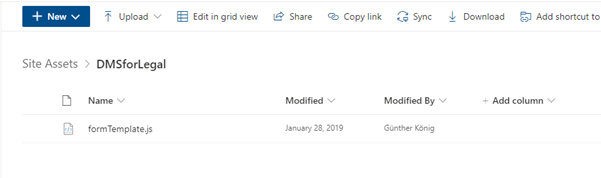
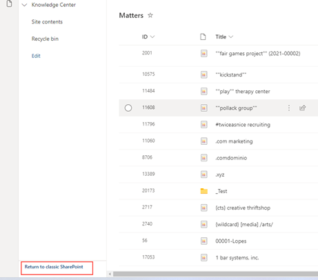
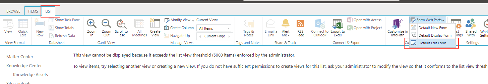

# Manual Installation of Matter-Client form script

1. Place the formTemplate.js script in a folder ‘DMSforLegal’ within Site Assets

1. Go to the list, and select ‘Return to classic SharePoint’

1. Select ‘List’ and then the form you want to edit

1. Select ‘Edit Page’

1. Select ‘Edit Web Part’ from the web part menu

1. Go to the ‘Miscellaneous’ section and paste the link:~site/SiteAssets/DMSforLegal/formTemplate.js

