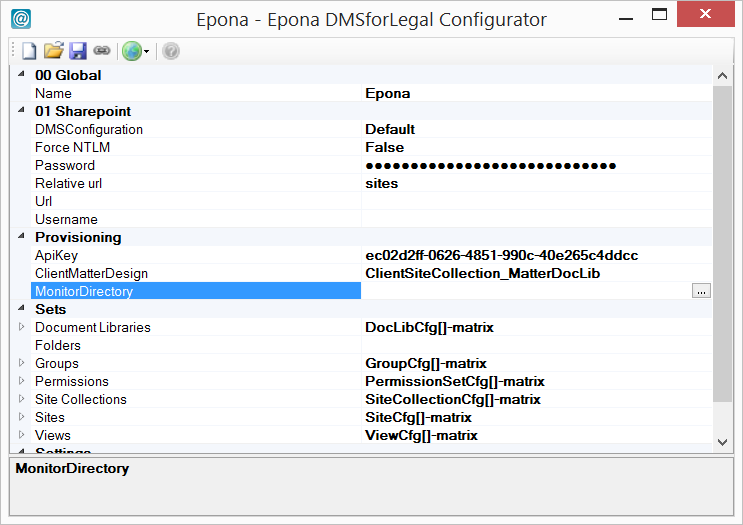

# Configurator

Start the configurator.exe to configure the connection to sharepoint and the site provisioning settings.

The settings are stored in the subdirectory ./Config in json format. Sensitive information (like passwords) are encrypted using AES encryption. If more security is necessary, use NTFS file system permissions to protect the file (and give configured  Site provisioning Service User also full control permissions).

