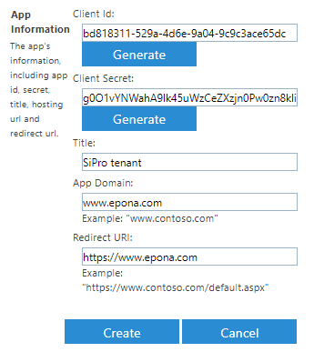
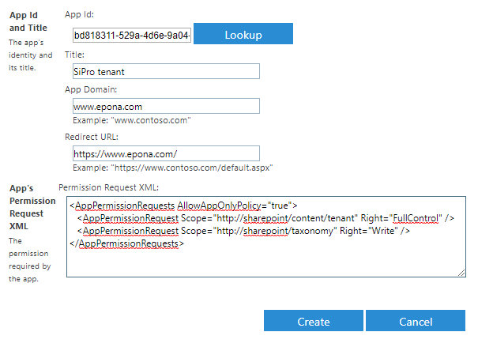

# SharePoint Application Registration

Applications registered directly in SharePoint will not be available in Azure AD and will be limited to SharePoint only.
These registered applications can't have Graph permissions or other non SharePoint permissions.

For tenant permissions, go to <https://[tenant]-admin.sharepoint.com/_layouts/15/appregnew.aspx>
Generate a client/app id and client secret and fill in the other three fields.

Go to <https://[tenant]-admin.sharepoint.com/_layouts/15/appinv.aspx>, lookup the client/app id and assign tenant permissions:

XML:

~~~~html
<AppPermissionRequests AllowAppOnlyPolicy="true">
   <AppPermissionRequest Scope="http://sharepoint/content/tenant" Right="FullControl" />
   <AppPermissionRequest Scope="http://sharepoint/taxonomy" Right="Write" />
</AppPermissionRequests>
~~~~

Keep in mind that the application will not have any permissions to existing site collections.
