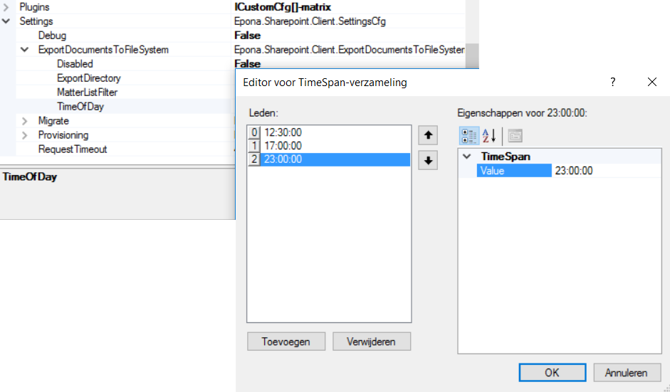
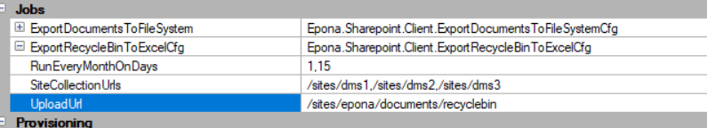
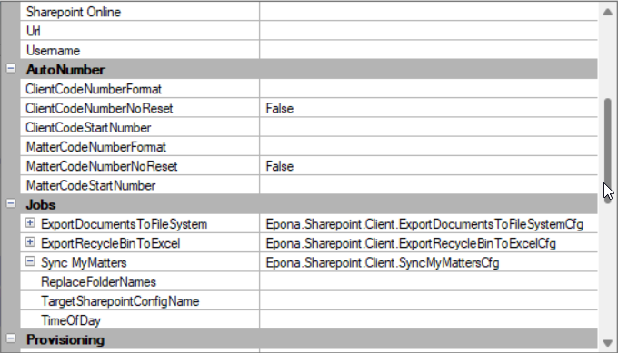
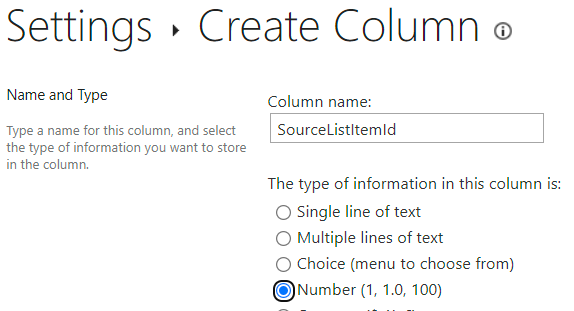

# Standard Jobs

No manual installation is necessary for these jobs.

## Export Files

A job can be scheduled to periodically export all the files from the document libraries to a file system for backup purposes (or internet failure). This job can run multiple times per day. Only new and/or updated files are exported. The matters from the matterlist are used. Optionally a filter can be set on the matterlist.

- Deleted files in SharePoint are not deleted from the filesystem. New files with the same filename overwrite the deleted file.

- Permissions are not copied from SharePoint to the filesystem.

- Metadata is not exported

- Each version in SharePoint is exported as separate file to the filesystem (using suffix \_\_v\<major.minor\>)

The configuration is stored in \\Setttings\\ExportDocumentsToFileSystem



The incremental backup is optimized by using the lastmodifed value from the doclib. When a doclib / directory is exported the lastmodified value of the directory is updated with the lastmofied value from the doclib/folder from sharepoint. The next incremental backup uses the local modified value of the directory to identify if the doclib/folder is changed.

If *ExportDirectoryUseMatterCodeAndName* is enabled the directory name is formatted like `[mattercode]__[mattername]` (double underscore). If the directory is not found, a match is searched via the `[mattercode]__*` (or equal to `[mattercode]`). If a match is found, the directory is renamed (if technically possible). The mattername is truncated at 50 characters.

## Cleanup Completed Monitor directory

A daily job can be executed to delete old files from the completed monitor directory. See *Settings, Provisioning*.

The job is scheduled to be started (random) between 0:00 and 06:59.

*CleanupCompletedMonitorDirectory*\
Files older then the specified number of days will be removed. If set to 0, no files are removed.

*CleanupCompletedMonitorDirectoryFilters*\
Specify one ore more filters to only delete files with the specified filters. If left empty all files are deleted.\
For example:

- *.json
- clientmatter*.json

## Export Recycle Bin content to Excel

Use this job to periodically dump the items (meta-data, no documents) of the recycle bin of one or more site collections to an excel file. The *DeletedDate* value is an UTC value.

- RunEveryMonthOnDays\
Specify one or more days when the job should be scheduled. The job will run every month on these days. It will be executed during the night on the specified day.

- SiteCollectionUrls\
Specify on more url's to the site collection. Each recycle bin will be exported to a separate excel file

- UploadUrl\
Specify the url to a doclib/folder where the result excel file should be uploaded.



- UploadSingleExcelFileName\
If the items should be saved into a single excel file, specify the filename that should be used. If no file name is specified, for each sitecollection a separate excel file is created with the name of the sitecollection.

## Sync My Matters

Use this job to sync the MyMatters list to another DMSforLegal installation. For example, to sync an on-premise my matters list to a sharepoint online my matters list.



Specify the job in the source dmsforlegal installation by specifying the name of configuraton file that contains the target location. Specify one or more timestamps when the job should be started.

The job can only work if the target My Matters list is extended with an additional column. Also create an index on this column to prevent the threshold exception for large lists.

- Column name is *SourceListItemId*
- Type is Number

It is also necessary to create a mapping between the foldernames that are used in the source and target environment if the login is different between the environment. Use the setting *ReplaceFolderNames* to create a mapping with the syntax source=target, or use an external *.txt file that contains the mapping. Use an empty mapping to skip the sync for that user. For example:

```text
dissel=marco_dissel_epona_com_
lang=
```

*SkipIfNotDefinedInReplaceFolderNames*\
If enabled only sync folders (users) that are explicitly defined in the ReplaceFolderNames.



When the sync has run successfull the job will store the latest changetoken in the config\\SyncMyMatters\\ directory. If it's necessary to sync all items from the source to the target, open the config\\SyncMyMatters\\&ast;.json file and set the *SyncAllItems* to true. When syncing all items, there are no items deleted, only added or updated. This option is automatically disabled when it has been executed.

When an item is created/updated in the source, the following steps are executed:

- find item in target via the field Source ListItem Id
- if found, update the existing item and continue with next item
- if not found,
- search for matter in target, if not found continue with next item
- create or update item in target

When an item is deleted in the source, the item will be found via the Source ListItem Id in the target and also deleted. If not found, nothing is done in the target.

## Sharepoint Monitor Folder

Use this job to sync a sharepoint folder with a local monitor to handle files.

This job has 3 main features:

**1st** It will download all files in the sharepoint monitor folder and store them in the local monitor folder, deleting the files from sharepoint folder.

**2nd** It will upload all files from the local Completed folder to the sharepoint Completed folder, deleting the files locally.

**3rd** It will upload all files from the local Error folder to the sharepoint Error folder, deleting the files locally.

This job can be configured to use multiple sharepoint monitor folders. In each of these sharepoint monitor folders must be created the Completed and Error folders.

To use the Job start the configurator and configure the following fields:

**SyncSharepointMonitor/FolderUrls**
Specificy multiple urls for multiple monitor document libraries

**SyncSharepointMonitor/Interval (minutes)**
Set the job to run every x minutes
