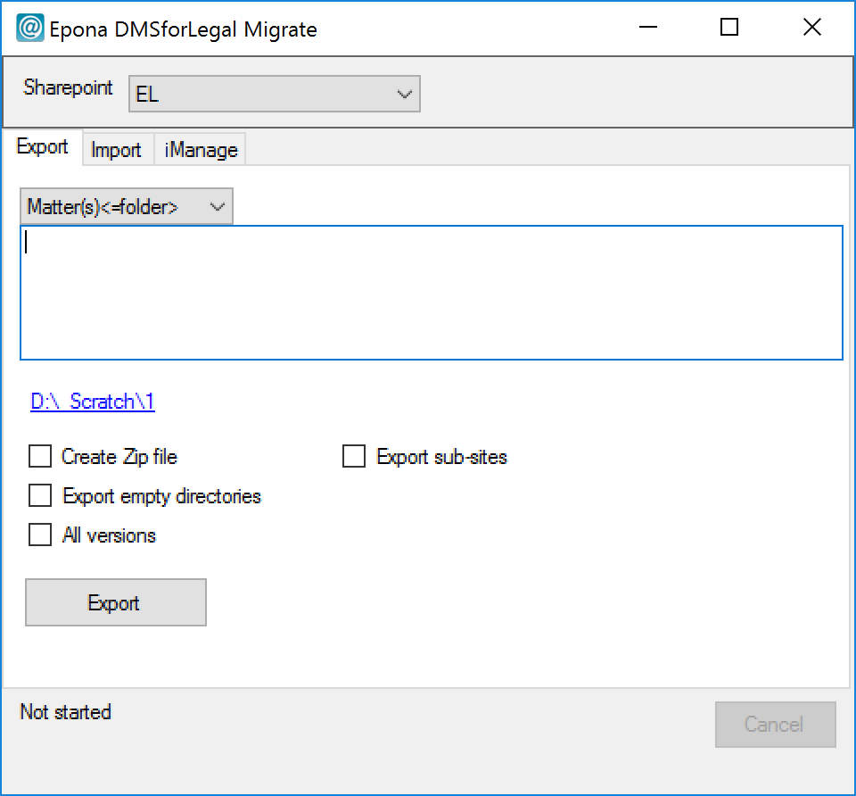

# File migration

The file migration tool uses the same configuration files as the site
provisioning tool. The only necessary configuration items for the
migration tool to run are the inside *Sharepoint* section (url,
username, password)

Metadata values can be mapped to the target sharepoint environment. By
default the same value is written to sharepoint, but by configuring
*Settings, DynamicaFieldMapping* items, for each field and value another
value can be configured. Use the following prefix "Sharepoint",
"OpenText", "iManage" combined with a dot and the name of the field, for
example "OpenText.DocumentType".

