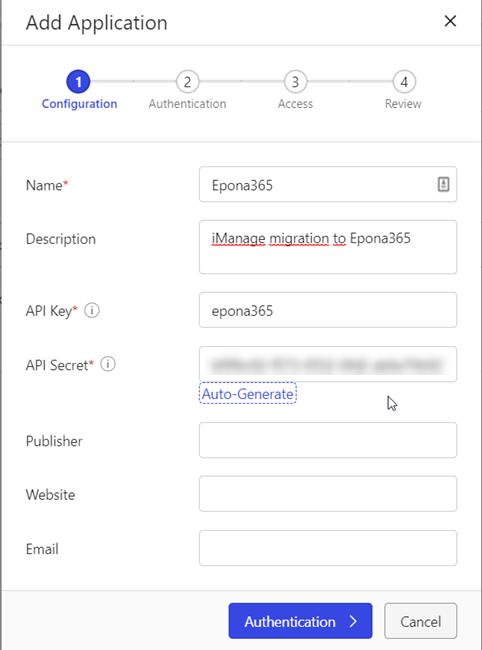
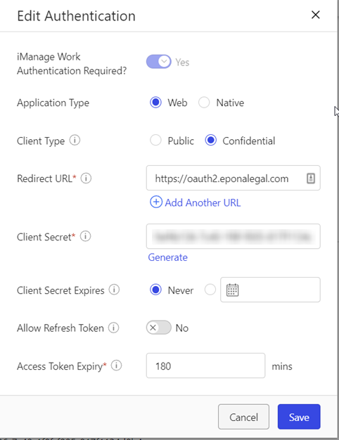
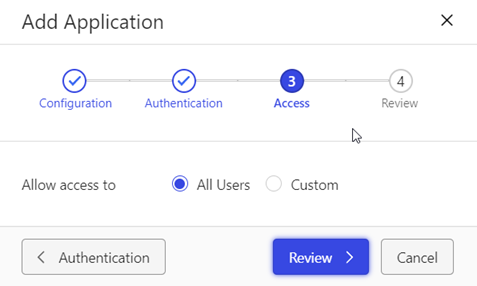

# iManage Web

Copy the Files from the \\Plugins\\Migrate\\iManageWeb directory.

Start the migrate tool, a new tab is visible. Click on ... button to create or edit an iManage web configuration. The configuration is stored in the \\Config\\iManageWeb directory.

## iManage Configuration

- Authentication

Specify the url where the iManage web environment can be accessed. For example <https://imanageweb.epona.com/>.\
Create an *Application* in the iManage control center.

Specify the authentication properties

and set the allow access to All users.

Specify the clientid (Api Key) and client secret  (API secret) in the settings and specify an (virtual) username and password. The migration tool will login using the clientid/secretkey and the username/password settings. The migration tool will have the same permissions as the specified user. To access all workspaces/folders/documents make this user member of the group *NRTADMIN* AND the role *NRTADMIN*.

Also specify the name of the library that contains the documents that needs to be migrated.

- Client / Matter custom table

By default the custom1 table is used for the Client Information and the custom2 table is used for the Matter Information. This can be overridden by specifying the correct custom table number in the setting *CustomClientTableNumber* and the *CustomMaterTableNumber*. (valid
numbers 1..12 or 29..30)

- Contenttypes

The class and subclass can be mapped to a contenttype in sharepont. Specify one or more items using the following syntax:

\<C_ALIAS\>.\<SUBCLASS_ALIAS\>=ContentType\
\<SUBCLASS_ALIAS\>=ContentType\
\<C_ALIAS\>=ContentType

If a match is found in the above order, that contenttype is used. If no match is found the default content type from the doclib is used.

It's also possible to specify an external text filename, use the extension .txt. Copy the content to a text file and specify a the file
path relative to the installation directory in the setting.

- Users/Groups

The username and groupname can be converted into a sharepoint username/group. Specify the loginname or groupname and the new
sharepoint name in the following format

\<USERNAME\>=\<Sharepoint username\>\
\<GROUP\>=\<Sharepoint/Windows AD group\>

Optionally use the ReplaceUserGroupNames setting in the Sharepoint config, section Settings. If that mapping contains an empty mapping with
a default username, that username is used when the user is not found in Sharepoint.

It's also possible to specify an external text filename, use the extension .txt. Copy the content to a text file and specify a the file
path relative to the installation directory in the setting.

- TargetFolders

See 6.4.2, Replace TargetFolder

- ImportDocumentPermissions

Custom document security is migrated (when security is different from folder). This can be disabled via the setting "import document
permissions" = false. The author and/or operator are NEVER added to the permissions with full control. Author and Operator always have full
control in iManage without having explicit permissions on the document. If necessary use the DumpDocSecurity and manually import the
author/owner.

**Workspace and Folder permissions are NOT migrated!** The dump file contains the custom security on workspaces and folders. This sheet can
be optionally used to import via "PermissionSet" import in the monitor directory of the site provisioning tool.

*FolderPermissionPublicGroupName / FolderPermissionViewGroupName*\
Folders can have the default Permissions Public (read/write) or View (read) access. Optionally specify the sharepoint group name that should be used to assign Contribute or Read permissions in sharepoint.

- ImportShortcuts

If enabled only documents that exists in multiple folders are migrated as \*.url document, containing a reference to the first migrated document. The oldest entry that is created in a folder is migrated as real document.\
The import of shortcuts is **NOT** logged in the database. When the import is executed again, it can create a new URL file if the documentname is updated.

- Metadata Fieldmapping

By default the values for the metadata from iManage are used in Sharepoint. To update the values use the DynamicFieldMapping in the sharepoint configuration. Use the following fieldnames and map the code to a new value.

- iManage.DocumentClass

- iManage.DocumentClassSub

- iManage.DocumentClassAndSubClass (combination of class and subclass
 separated with a dot (.).)

- iManage.Operator

- iManage.Author

- iManage.C1ALIAS C16ALIAS

- iManage.C29ALIAS C30ALIAS

## Dump

To analyze the information that is stored in iManage, use the this option to create an excel file containing the following information from iManage:

- Workspaces
- Metadata
- Folders
- Permissions (folders/workspaces)
- Custom tables
- Users, Groups and roles

## Report

Create an excel file containing the information about the import result.

- Folders, exported documents and errors

- DocumentErrors, list all documents with an error
