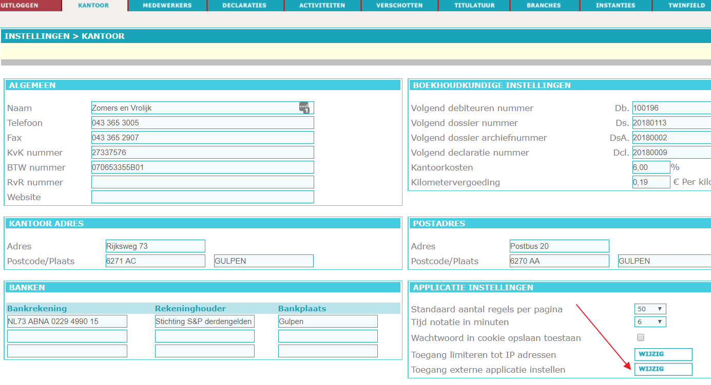

# AdvocaatCentraal

This plugin will periodically query the AdvocaatCentraal application for new and updated matters.

Copy the dll files from the Plugins\\ AdvocaatCentraal directory to the site provisioning directory.\
Restart the service to activate the plugin.

Start the configurator and browse to CustomSettings to configure the AdvocaatCentraal plugin.

Specify the username and password. Username / Password should be manually created in AdvocaatCentraal as a separate API user.

The plugin will schedule a job using the interval in minutes, start and end datetime properties. After each run the LastRunDate is updated. Only created or changed matters after that time are converted to json files and dropped in the monitor directory.
