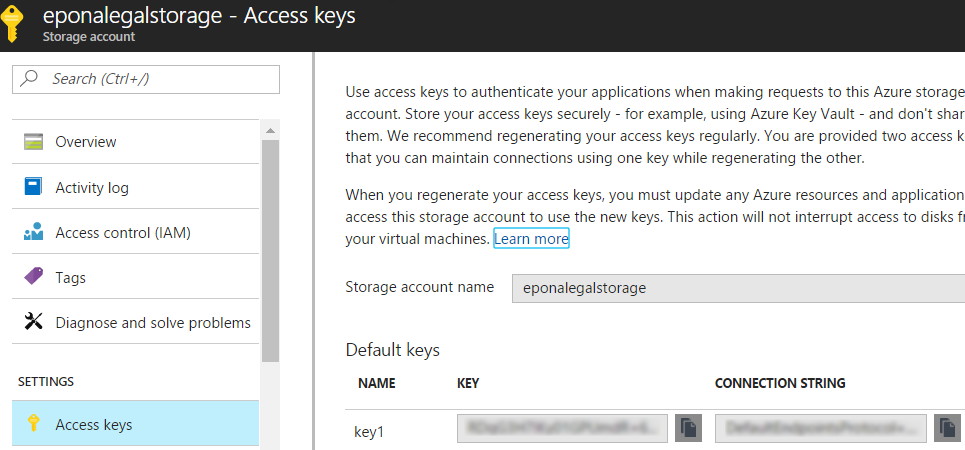
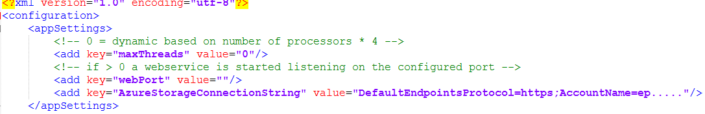
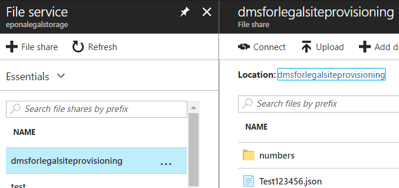

# Azure Storage

The site provisioning service can be run as an azure job. The configuration files should be stored on an Azure Persistent Storage.

- Create a new or use an existing Azure Storage location.

- Copy the connectionstring of the azure storage to the clipboard

> 

- Open the *Epona.ProvisioningService.exe.config* and put the connectionstring in this section/key.

~~~xml
<add key=\"AzureStorageConnectionString\" value=\"DefaultEndpointsProtocol=https;AccountName=ep\.....\"/\>
~~~

> 

When the azure job is started a new file share is created, dmsforlegalsiteprovisioning. This share is used to store the configuration and the auto-number settings for the service.

To enable Azure logging instead of the default logging, change the section in *Epona.SiteProvisioning.exe.nlog* file to enable Trace logging.

~~~xml
<rules\>
    <logger name=\"\*\" minlevel=\"Trace\" writeTo=\"Trace\" /\>
</rules\>
~~~
