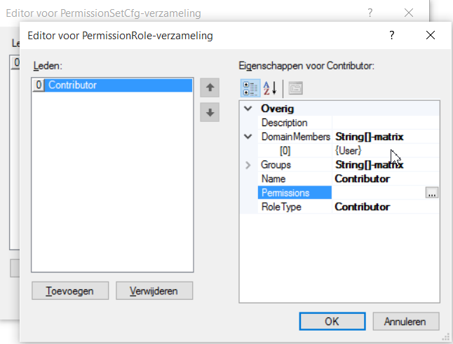

# Create Personal sites

Goal: Create a doclib for every user and only the user has contribute permissions in the doclib.

Create an excel file with a fixed clientcode/name. Use a unique mattercode/name for each personal site. Add an extra column '\_\_User' with the windows domain username (or email address).

Create a permissionset *Personal*. Disable inheritance, Add a role, specify Contribute and Domain Members = {User}

Create a doclibset 'Personal' and specify the permissionset Personal.

The value {User} will be replaced with the value \_\_User from the excel sheet.
