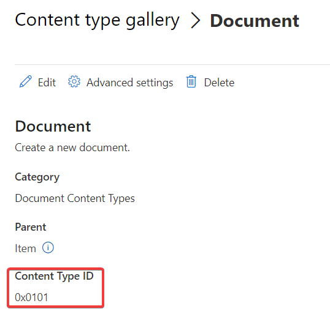
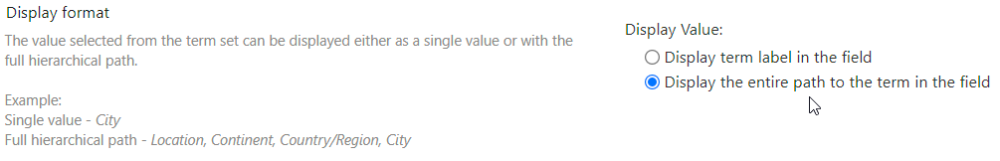

# Contenttype sets

Create one or more contenttypes. The references fields should already exist in the site and can be created by specifying *Columns* in the sitesets.

Specify the **internal** fieldnames (encoding is not necessary) and optionally add a prefix =true to specify if the field is required.

Sample:\
Creation time

SHAREPOINT ONLINE:
If *FromContentTypeHub* is enabled, the contenttype is pushed from the hub to the web. No additional configuration is necessary (only the *Name*)

## Parent Contenttype

The name of the contenttype is localized by SharePoint (for example Documento in Spanish). It's also possible to specify the Id as the name of the contenttype, for example 0x0101 for Document.

## Date time

When importing information try to format the date using the ISO8601 format. Always use the UTC time when time is specified.

Date: yyyy-MM-dd

Date and time: yyyy-MM-ddThh:mm:ss

## Taxonomy

When multiple levels are used in the taxonomy store, use the : as a separator when importing / assigning information. The search is case-insensitive and not recursive, the full path is necessary.

When exporting files with taxonomy fields and multi level be sure to activate the setting:

## User

Specify the loginname to find a match with an existing user. Optionally use the ReplaceUserGroupNames setting in the Sharepoint config, section Settings. If that mapping contains an empty mapping with a default username, that username is used when the user is not found in Sharepoint. If the an existing mapping is found for the value the specified value is used to find the user in Sharepoint. See 3.8.3.
