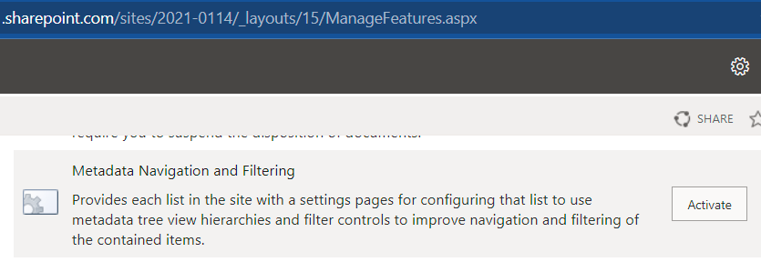

# Document Library sets

Folders inside the document library are also created if the document library already exists and one or more folders are missing.

Folder names can contain variables that are replaced at runtime. See [Dynamic Name Matching](./../siteprovisioning/Dynamic%20Name%20Matching.md)

If the Enterprise Keywords setting is enabled, manually add the field *TaxKeyword* to the content-types (if required).

When specifying the max number of major/minor versions, leave empty, to use the default from Sharepoint. Specify 0 to set the number to an infinite value.

## Import documents from template

If default documents should be added to the new document library, specify the (Sharepoint) url to the folder where the default documents are stored in the setting *ImportDocumentsFromTemplate*. The documents (and sub-folders with documents) are copied to the new document library, using the same directory structure. If a subfolder is specified in the url, the documents are copied to the subdirectory with a relative path. It's possible to use variables in the folder and document names (like "Document {MatterCode}.docx").

## Alerts

Define one or more *email* alerts that can react on document/folder changes. The alert will be send immediately. Alerts are never updated, only created if for the specified user and folder no current alert exists.

- Folder

If no folder is specified, the alert will react on all the documents in the library. If a folder is specified, only items in that folder (or subfolder) will raise an alert

- User

Specify one or more users (separated by ; ). For each user a separate alert will be created.

- Filter

Optionally specify specify a custom CAML query (including the ```<Query>``` tag). Use the variables ```{AlertFolder}``` or ```{AlertUser}```. These values are replaced with the configured folder and/or user.

- Alert DayOfWeek

If a day of week is configured, the alert will be send once a week on the configured time (see Alert Time). If no time is specified, 8:00 is assumed.

- Alert Time

If a time is specified (format is HH:mm), the alert will be send once a day on the specified time.

## Managed Navigation and filtering

If this is configured, also enable the Metadata Navigation and Filtering site/web feature in the siteset.\


The *AutoIndex* option is not enabled when activated, manually configure the indexes if required.\

*Enabled*\
If left empty, no changes are applied. If false, the default settings are applied and the navigation/filtering is disabled. If true, specify the hierarchy and filter fields.

*Hierarchy and filter fields*\
Specify one or more internal fieldnames to configure the field as hierarchy or filter
