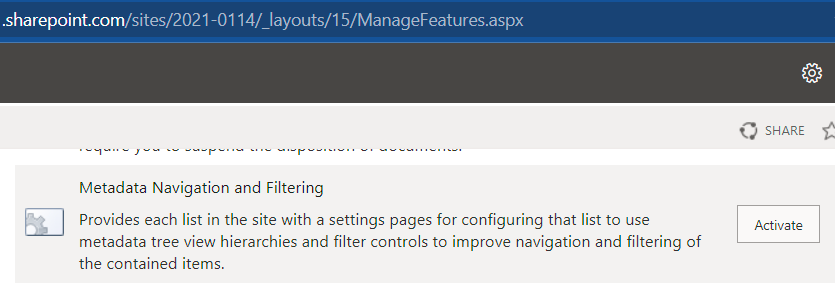
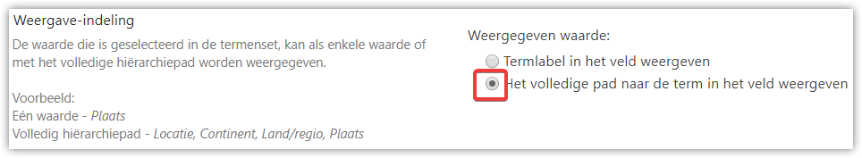

# Site Provisioning

## Installation

To install/configure the service as a service, use the following parameters for the *Epona.ProvisioningService.exe*

*help* or --help Displays help

*install* Installs the service

-username The username to run the service

-password The password for the specified username

-instance An instance name if registering the service multiple times

\--autostart The service should start automatically (default)

\--disabled The service should be set to disabled

\--manual The service should be started manually

\--delayed The service should start automatically (delayed)

\--localsystem Run the service with the local system account

\--localservice Run the service with the local service account

\--networkservice

Run the service with the network service permission

\--interactive The service will prompt the user at installation for the service credentials

\--sudo Prompts for UAC if running on Vista/W7/2008

-servicename The name that the service should use when installing

-description The service description the service should use when installing

-displayname The display name the the service should use when installing

*start* Starts the service if it is not already running

-instance The instance to start

*stop* Stops the service if it is running

-instance The instance to stop

*uninstall* Uninstalls the service

-instance An instance name if registering the service multiple times

\--sudo Prompts for UAC if running on Vista/W7/2008

The service can be run as a console application by starting the executable *Epona.ProvisioningService.exe* without any parameters.

After downloading check if the files are not blocked. Use this PowerShell script to unblock the dll/exe.

~~~powershell
Get-ChildItem \<path to your folder\> -recurse \| Unblock-File
~~~

## Email

There are two options to get an email alert when an error has occurred:

### Send email during file processing

This method will only send a single email when the processing of a file has failed when dropped in the monitor directory. Configure the email settings in \\Settings\\Email.

### NLog Target error

Optionally you configure the service to send an email when an error has occurred somewhere in the application. You can specify the options in the Epona.ProvisioningService.exe.nlog file, see target *mailbuffer* and enable the rule *writeto=mail*. For all options see <https://github.com/nlog/NLog/wiki/Mail-target>

## Configuration

Start the Configurator.exe to create one or more configuration objects. Each object contains a monitor directory and a sharepoint configuration object. Files that are dropped in the specific monitor directory are executed using the linked configuration file.

Use the configurator tool to create/modify the settings.

Create named sets of settings. Via the Excel or the json file the named configuration sets can be referenced.

WARNING ! Don't change the *Name* of a configuration item, if it's already referenced in another set. (if needed find/replace the name directly in json).

## Office 365 Groups / Microsoft Graph

When the site provisioning should create Office 365, the MS Graph API is used and should be properly configured.

Goto <https://portal.azure.com>

Select Azure Active Directory Services

Select App registrations

- Create a new application

- WebAPI / API

- Create App

- Copy ClientID / Toepassings ID (Application ID) and add this key to Site prov. Configuration SharepointClientID

Permissions

- Add MS Graph

- Add all Application Permissions OR Group.ReadWrite.All, Site.ReadWrite.All, User.Read.All, Notes.Read.All

- !! Click on *Grant Permissions* before authenticating the first time !!

Keys

- Generate a new Key

- Copy Key and add this key to the Site Prov Service SharepointClientAppKey

<https://apps.dev.microsoft.com/>

or

<https://portal.azure.com/#blade/Microsoft_AAD_IAM/ActiveDirectoryMenuBlade/RegisteredApps>

Create another application to support access via an user token (require for some updates, like updating logo and the beta msgraph)

- Create a new application

- Native

- Create App

- Copy ClientID / Toepassings ID (Application ID) and add this key to Site prov. Configuration *Client ID Delegated User*

- Add Permissions

- Add MS Graph

- Add

  - all Application Permissions\
  
    OR

  - Group.ReadWrite.All, Directory.ReadWrite.All.

- !! Click on *Grant Permissions* before authenticating the first time !!

## Yammer configuration

Yammer needs an OAUTH2 Accesstoken. This token can be manually generated via de the browser.

See here <https://developer.yammer.com/docs/test-token> for the steps to generate a token.

The result JSON contains an accesstoken that is valid for one year. Add this token to the Settings\\Yammer *AccessToken*

This procedure should be repeated when the token has expired.

## Sample files

When the service is started a set of samples files is created. The filename of the sample file is the unique filename. The service will execute the correct handler based on this filename. At a minimum files that are placed inside the monitor directory should *contain* the filename of the sample file.

## Client Matter Design

The following design implementation are supported. A default set can be configured for the Client and the Matter using the default *ClientSet* and *MatterSet* settings. The following order is used when resolving the (dynamic) name of set

- clientmatter*.json
- default client/matter set
- first defined set

### MatterSiteCollection

For each matter a new site collection is created with one or more document libraries. Nothing is created for the client.

Use the setting ConvertToGroupOrTeam to convert/create the matter sitecollection to an Office 365 group or Team. The setting can be set with a variable like {Groupify}. If the value can be convert to true, the existing sitecollection will be converted into a group/team (using the groupset configuration), for new matters a group/team is created. See <https://docs.microsoft.com/en-us/sharepoint/dev/transform/modernize-connect-to-office365-group#what-connecting-to-a-new-microsoft-365-group-does-to-your-site>

### MatterSite

For each matter a new site is created with one or more document libraries. Nothing is created for the client.

### MatterDocLib

For each matter a new document library is created. Nothing is created for the client.

### MatterOffice365Group

For each matter a new Office365 group is created, optionally connected to a Team and/or Yammer. Nothing is created for the client.

### ClientSiteCollection_MatterSite

For each client a new site collection is created. For each matter a new site is created with one or more document libraries.\

Extend the client list with a column SiteURL (definition is equal to the SiteURL column in the matterlist). This column will be updated with the url where the client sitecollection is created and will be used for each new matter site for the client.

### ClientSiteCollection_MatterDocLib

For each client a new site collection is created. For each matter a new document library is created.\
Extend the client list with a column SiteURL (definition is equal to the SiteURL column in the matterlist). This column will be updated with the url where the client sitecollection is created and will be used for each new matter doclib for the client.

### ClientSite_MatterSite

For each client a new site is created. For each matter a new site is created with one or more document libraries.\
Extend the client list with a column SiteURL (definition is equal to the SiteURL column in the matterlist). This column will be updated with the url where the client site is created and will be used for each new matter site for the client.

### ClientSite_MatterDocLib

For each client a new site is created. For each matter a new document library is created.\
Extend the client list with a column SiteURL (definition is equal to the SiteURL column in the matterlist). This column will be updated with the url where the client site is created and will be used for each new matter for the client.

*SiteURL column*\

- create a single line column with internal name SiteURL

- specify column name formatting value

~~~json
{
  "$schema": "https://developer.microsoft.com/json-schemas/sp/v2/column-formatting.schema.json",
  "elmType": "a",
  "txtContent": "@currentField",
  "attributes": {
  "target": "_blank",
    "href": "@currentField"
  }
}
~~~

## ServerRelativeUrl

Specify one or more url's where new sitecollections/sites are created. For example: /sites.\
Use ; as a separator to specifiy multiple url's, like /sites/dms1;sites/dms2. The site provisioning service will create the new site or doclib in the sitecollection/site with the least items (sites/doclibs), als known as "round robin"

## Dynamic Name Matching

Each configuration object is configured with a name. The set name inside the json or excel file can contain variables. The variables can contain the title of the specific Sharepoint object (use {Title}) or one or more additional properties. Use the syntax {\<name of property\>} (case insensitive).

{yyyy} or {yy} is replaced with the current year.

{yyyy+1} or {yy+1} or {yy-3} is replaced with the current year +/- X (max value = 12)

{mmmm}, {mmm}, {mm} or {m} is replaced with the current month

{mmmm+1}, {mmm+1} or {mmm-3} is replaced with the current month +/- X (max value = 12)

{dddd}, {ddd}, {dd} or {d} is replaced with the current day

### Set Name Matching

Example:

Client{ClientCode}, ClientCode = 123

At runtime the {ClientCode} is replaced by the clientcode from the additional properties. The service will try to find a set with the name of *Client123* and if not found *Client*

Matter{MatterType}, MatterType = Tax

At runtime the {MatterType} is replaced by the MatterType from the additional properties. The service will try to find a set with the name of *MatterTax* and if not found *Matter*

Client{ClientCode}{MatterType}, ClientCode = 123, MatterType = Tax

The service will try to find a set with the name of Client123*Tax*, if not found *Client123*, if not found *Client*

*Doclib{MatterType},* Title = SecureDocs, MatterType = Tax

The service will try to find a set with the name of *DoclibTax\_*SecureDocs, if not found *DoclibTax*, if not found *Doclib*

*Doclib{Title}{MatterType},* Title = SecureDocs, MatterType = Tax

The service will try to find a set with the name of *Doclib*SecureDocs*Tax\_*SecureDocs, if not found *Doclib*SecureDocs*Tax*, if not found *Doclib*SecureDocs, if not found *Doclib*

### Replace value

Via the settings, Dynamic Names values, in the configuration custom values can be assigned for each field. This can be used to translate values from *'Gesloten'* to '*Closed'*. Specify the name of the field and for each field specify an old value and new value. The new value is used in the dynamic part of the property.

*UnknownValue*\
If a value (not empty!) is not found in the mapping, a default value can be returned by enabling *UseUnknownValueIfNotFound* and specifying a default value via *UnknownValue.*

*DefaultValueIfEmpty\
*If the value is empty, optionally specify a default value that should be used.

Use the prefix *Title* ("Title.\<fieldname\>") to only replace a value when the variable is used in a title field (matterlist/site(collection)).

It is also possible to configure a replacement of a character by specifying the name as ```:``` and a replacement value as: ```/```.

An example: a multilevel taxonomy field is used in the mattername, the : should be replaced with a ```/```.

FieldName: Title.MatterType\
Mapping:
name: ```:```
value: ```/```

The result is that a value of "NL:Tax" is converted to "NL/Tax" when the variable {MatterType} is used in the Title.

It's also possible to enable use the configured replace value when a client matter json file is parsed. Use the following prefixes:

ClientMatterDesign\
ClientMatterServerRelativeUrl\
PageTemplateUrl\
MatterListFolderName\
Office365GroupChannelName\
Office365GroupVisibility\
SiteCollectionTemplate\
DoclibCompliance

### Username/Group name

User and group names can contain variables that are replaced at runtime.

When Sharepoint online is used, the English names can be used for the built-in groups 'Everyone' and 'Everyone except external users'. At runtime these names are translated into the correct language of the current web.

Via Settings *Replace User/group names* you can specify an old and new name in the format:\
nl\\lang=marcel.lang\@epona.com

It's also possible to specify an external text filename, use the extension .txt. Copy the content to a text file and specify a the file path relative to the installation directory in the setting.

## SiteCollection sets

**FormatUrl**\
By default the *MatterCode* is used as the url for the new sitecollection. Optionally specify a dynamic name to change the url, for example:

- DMS\_{MatterCode}

- /teams/DMS\_{MatterCode}

If the the UrlFormat starts with a / the default *ServerRelativeUrl* is ignored.

### Team Site

Change the *SiteDesign* to Team. A modern team site without an office 365 group is created.

### Communication Site

Change the *SiteDesign* to something not equal to Team.

To enable *ShareByEmailEnabled* set the *SharingCapabilities* not equal to Disabled.

### Groups

To change the membership of the default built-in groups "\<sitename\> Visitors/Members/Owners" group, use \_Members, \_Visitors or \_Owners as group name.

## Site sets

### Template

The site prov. tries to find match on the existing templates on the template Title or ends with \#\<template\>on the Name. If not found, it will upload the file to the catalog from disk, make sure the filename of the template and title are equal.

### Template Configuration

- QuickNavigation

When Remove is true, an existing navigation item is removed based on a match on the *Title.*

### Doc ID provider

The *Code* specified for the site collection is also used for the doc id prefix. Special characters are removed, only letters and numbers are supported. The minimum length is 4 characters, zeros are prefixed if the length is too short. The maximum length is 14 characters, the last 14 characters are used when the length is too long.

### Matter Status Open / Closed

The matterlist can contain a column that holds the matterstatus. This column can be configured in the *Settings, SiteProvisioning, MatterStatusColumnName*. Together with the option *MatterStatusClosedValues* a site can have a status of Close or Open.

Via an EXISTING policy that is created in the sitecollection, a policy can be applied when the matter status is closed. For example to make the site readonly.

A policy can be created manually in the sitecollection or published via the contenttype hub. Before a policy can be applied it should be active on the site. The name of the policy (case sensitive!!) can be configured on the web set, *PolicyName*.

### Site sharing

To change the site sharing change the setting RequestAccessEmail to true or false. If enabled optionally specify an emailaddress in the setting RequestAccessEmailAddress. If the email adress is empty and *RequestAccessEmail* is enabled,the default "owners" group is set.

## Document Library sets

Folders inside the document library are also created if the document library already exists and one or more folders are missing.

Folder names can contain variables that are replaced at runtime. See [Dynamic Name Matching](#dynamic-name-matching)

If the Enterprise Keywords setting is enabled, manually add the field *TaxKeyword* to the content-types (if required).

If default documents should be added to the new document library, specify the (Sharepoint) url to the folder where the default documents are stored. The documents (and sub-folders with documents) are copied to the new document library, using the same directory structure. If a subfolder is specified in the url, the documents are copied to the subdirectory with a relative path. It's possible to use variables in the folder and document names (like "Document {MatterCode}.docx").

When specifying the max number of major/minor versions, leave empty, to use the default from Sharepoint. Specify 0 to set the number to an infinite value.

### Alerts

Define one or more *email* alerts that can react on document/folder changes. The alert will be send immediately. Alerts are never updated, only created if for the specified user and folder no current alert exists.

- Folder

If no folder is specified, the alert will react on all the documents in the library. If a folder is specified, only items in that folder (or subfolder) will raise an alert

- User

Specify one or more users (separated by ;). For each user a separate alert will be created.

- Filter

Optionally specify specify a custom CAML query (including the ```<Query>``` tag). Use the variables ```{AlertFolder}``` or ```{AlertUser}```. These values are replaced with the configured folder and/or user.

- Alert DayOfWeek

If a day of week is configured, the alert will be send once a week on the configured time (see Alert Time). If no time is specified, 8:00 is assumed.

- Alert Time

If a time is specified (format is HH:mm), the alert will be send once a day on the specified time.

### Managed Navigation and filtering

If this is configured, also enable the Metadata Navigation and Filtering site/web feature in the siteset.\


The *AutoIndex* option is not enabled when activated, manually configure the indexes if required.\

*Enabled*\
If left empty, no changes are applied. If false, the default settings are applied and the navigation/filtering is disabled. If true, specify the hierarchy and filter fields.

*Hierarchy and filter fields*\
Specify one or more internal fieldnames to configure the field as hierarchy or filter

## Folder sets

You can defined one or more folderset. The folders can contain a variable.

Folder-names are splitted by a line break character. For example, create a Folders columns with a memo field-type to create dynamic folders (splitted by a line break character)

For each folderset you can define a default value for one or more columns using the *ColumnDefaultValues* setting. If you define multiple folders in 1 folderset, all the folders get the same default values.

## Document sets

You can defined one or more documentset templates. To use documentsets:

- Enable the site feature DocumentSet, this will add a default DocumentSet contenttype.

- Define a new contenttype, using the DocumentSet as a parent contenttype (use the correct language for the parent contenttype name).

- Add the new contenttype to the document library

In the definition of the contenttype template, specify:

- The name of the DocumentSet

- The name of the contenttype

- One ore more allowed contenttypes (DMS Document / DMS E-mail)

- SharedFields, add all the fields that should be assigned to the documents that are stored in the documentset.

- Add one or more additional default values, for example DocumentType = Contract. The fields that already have a default value (via the doclib) should not be specified.

The last step is adding the documentset(s) with the documentlibrary set.

## Permission sets

By default permissions are only assigned when the object is created.

Set the *ReAssignPermissions* property to true to change the permissions of existing objects. The permissions on already created objects will be re-assigned in the next run. The site provisioning will store an unique identifier in the web object. If the key doesn't exists or the permissions set has changed the permissions will be reassigned. To force an update without changing the permissions update the *Name* to a different value.

Specify a *Name* and RoleType not equal to *None* to create a custom permission level.

If *ResetPermissions* is true, inheritance is enabled and **ALL** custom permissions assigned to all (nested) child objects are also reset. **!! Use with care !!**

If *DisableInheritance* is true and the object has inherted permissions, the *CopyRoleAssignments* and *RemoveCurrentPermissions* are used to Break the role inheritance, see [Microsoft Site](<https://msdn.microsoft.com/query/dev14.query?appId=Dev14IDEF1&l=EN-US&k=k(Microsoft.SharePoint.Client.SecurableObject.BreakRoleInheritance);k(TargetFrameworkMoniker-.NETFramework,Version%3Dv4.5);k(DevLang-csharp)&rd=true>)

If *RemoveCurrentPermissions* is true, the current assigned permissions are removed before adding the new permissions.

The Matter List can contain folder with specific permissions to protect the matter name for viewing when a user is searching the matter list. Use the setting *MatterListFolderName* to specify a foldername. When the PermissionSet is applied the matter list item is potentially moved to the specified folder. Optionally use dynamic names to use a value from a column in the matterlist. This will only work with the permissionset that is applied on the matter. Set *MatterListFolderEnabled* to true to enable this.

When *MatterListItemPermissionsEnabled* is enabled, the permissionset is applied to the single listitem. The permissionset can be specified in the json and/or plugins (using dynamic name matching).

To use the built-in groups for AssociatedOwnerGroup, AssociatedVisitorGroup and AssociatedMemberGroup use the fixed groupname: \_members, \_owners or \_visitors

## View sets

Create one or more views that can be used inside the doclib. To specify an ordering, use the following syntax in the *OrderBy* property. Use the same fieldnames as in the *Fields* property. Specify multiply fields on multiple lines.

*FieldName\
FieldName ASC\
FieldName DESC*

To specify a query create a CAML query and copy the XML WHERE part.

*Tip:* to create the CAML query create the view inside sharepoint and use the SharePoint Online Client Browser to copy the CAML. See <https://spcb.codeplex.com/>

## Office 365 Group sets

Use the *LogoLocalFilePath* setting to upload a logo. Variables are supported. The SiteLogoUrl from the attached site configuration will not work with a group.

### Members / Owners

The members and owners can also be configured to use a variable. At run time the members/owners are parsed and added.

The matterlist column can contain a multi-user column "Owners". Use the variable {Owners} in the office 365 group configuration in the *Owners* field.

Optionally the owners/members can also be updated, resulting in adding/removing owners/members from an existing O365 group. Enable *OwnerUpdate* or *MemberUpdate* to enable this.

Optionally the matter can also be added/removed for members/owners when the member/owner is added/removed to/from the group. Use *MemberAddMatterToMyMattersList* or *OwnerAddMatterToMyMatterList* to enable this. Use a ; as a separator for multiple values!

### Teams Channel / Tabs

One or more channels can be created inside the Team. Existing channels are matched on the displayname and if not found a new channel is created. The localized name for *General* is translated from other languages like dutch (Algemeen).

*Private  Channels*\
For private channels Sharepoint will create a new sitecollection. This sitecollection will be automatically provisioned with the configured site and pageset. It will check if the channel has a siteset configured and if not, the TeamChannelSiteSet on the Office365Group set or else the Office365group set.
Manual created private channels are provisioned with the TeamChannelSiteSet on the Office365Group set or else the Office365group set.

One or more MS Teams tabs can be configured for each channel.

Existing tabs are matched on the teamApp ID and if multiple found, also on the displayName. If not found a new tab is added.

Tabs are only deleted if *Remove* is set to true, for example to delete the default Wiki tab.

*SharepointPages* / *Sharepoint*\
If no url is specified, the home page is configured or specify a relative url to the page or list.

*SharepointNews*\
Show the news items from the current site/group. Url can be left empty.

*OneNote*\
The default OneNote linked to the site is fetched and configured for the tab. Url can be left empty

**Notes.Read.All** MS Graph Permissions are required!

*Planner*\
The tab is added, but not yet configured due to MSGraph delegated permissions requirement to read plans/tasks

## Page sets

Create one or more pages in a 'template' modern site collection.

Inside the O365 Group set select the pageset. At runtime the template page will be copied to the O365 group (when created or updated). Each webpart can be configured with dynamic settings using the {} naming convention.

When the page contains two identical webparts, the ordering on the page should also be the ordering in the configuration.

### Text webpart

The HTML can contain dynamic text. For syntax reference see <https://sharpscript.net/>

- Delve

You can add a link to the personal Delve page for a specific user by using the variable {UserID:\<property\>}. The property should contain a value that can be resolved to a user (like full name or email address)\
For example:\

~~~html
<a href=\'https://delve.office.com/?u={UserID:RTK}&v=work\'\>Delve\</a\>
~~~

- Date

This sample shows N/A where there's no date and show a formatted date value if a date is available.

~~~text
{{#if isnull(OpenDate)}}N/A{{else}}{{OpenDate | toDateTime | dateFormat('yyyy-MM-dd') }}{{/if}}
~~~

- Conditional Link

~~~html
{{#if isNullOrWhiteSpace(ClientCode)}}
 N/A
{{else}}
 <a href='https://server/client?client_id={{ClientCode}}' target='_blank'>{{ClientName}}
 </a>
{{/if}}
~~~

## Contenttype sets

Create one or more contenttypes. The references fields should already exist in the site and can be created by specifying *Columns* in the sitesets.

Specify the **internal** fieldnames (encoding is not necessary) and optionally add a prefix =true to specify if the field is required.

Sample:\
Creation time

### Date time

When importing information try to format the date using the ISO8601 format. Always use the UTC time when time is specified.

Date: yyyy-MM-dd

Date and time: yyyy-MM-ddThh:mm:ss

### Taxonomy

When multiple levels are used in the taxonomy store, use the : as a separator when importing / assigning information. The search is case-insensitive and not recursive, the full path is necessary.

When exporting files with taxonomy fields and multi level be sure to activate the setting:



### User

Specify the loginname to find a match with an existing user. Optionally use the ReplaceUserGroupNames setting in the Sharepoint config, section Settings. If that mapping contains an empty mapping with a default username, that username is used when the user is not found in Sharepoint. If the an existing mapping is found for the value the specified value is used to find the user in Sharepoint. See 3.8.3.

## Settings

### Provisioning

- MyMattersListColumnName

Specify one or more variables names (; separated (no comma!!!) ) that are used to add an entry to the My Matters List when a new matter is created.

- Matter Status

Specify a column name that holds the matter status. If one of values specified in the *Closed Values* setting are filled in, the matter is identified as closed. For closed matters some actions are not executed anymore like:

- Creating a matter list entry

- Creating a new site(collection)/doclib/office 365 group

- Create new parts inside an existing site(collection)/doclib/office 365 group

Metadata will be updated.

*Csv*\
The fileformat for files that are dropped in the monitor directory can also be the cvs format. Specify the delimiter in the setting CsvDelimiter. Double quotes can be used as a field value separator, but are optional.\
Sample:

\"Epona\";\"Epona;Legal\"

Will be parsed as two columns:\
Epona\
Epona;Legal

### Provisioning Extranet

If enabled, an extra matter is created in the matter list and the initial matter has a reference to the extranet matter. The settings for extranet can be set via *Settings, Provisioning, Extranet*:

If ClientListExtranetColumnNameCreate and/or MatterListExtranetColumnNameClientCreate and/or MatterListExtranetColumnNameMatterCreate are not empty, extranets will be optionally created.

ClientListExtranetColumnNameCreate\
Create an extranet for the client if the value of the column name in the client list can be converted to true. It's also possible to specify a value of \<true\> / yes, ja in this setting, resulting in always creating an extranet for the client.

MatterListExtranetColumnNameClientCreate\
Create an extranet for the client if the value of the column name in the matterlist can be converted to true. It's also possible to specify a value of \<true\> / yes, ja in this setting, resulting in always creating an extranet for the client.

MatterListExtranetColumnNameMatterCreate\
Create an extranet for the matter if the value of the column name in the matterlist can be converted to true. It's also possible to specify a value of \<true\> / yes, ja in this setting, resulting in always creating an extranet for the client.

The mattercode for the extranet is stored in the columname that is configured via the settings ClientListExtranetColumnNameMatterCode, MatterListExtranetColumnNameClientMatterCode and/or MatterListExtranetColumnNameMatterMatterCode.

!! At this moment the column name to store the matter can only have one value, ExtranetMatterCode. If both ClientExtranet and MatterExtranet are enabled, the reference that is stored with the initial matter is the matter extranet !!

***Client***

The mattercode for the extranet for the client will be stored in the client list, using the fixed (internal) column name *ExtranetMatterCode*. Optionally you can add this column to the matterlist, using the additional column feature of the *Client* lookup column.

ExtranetClientDesign\
Specify the design that should be use for the (extranet) matter for the client.

ClientClientDesignSet\
Specify the name of the *Set* that contains the settings for the client part of the provisioning (only used for design ClientSiteCollection_MatterSite, ClientSiteCollection_MatterDocLib, ClientSite_MatterSite, ClientSite_MatterDocLib).

ClientMatterDesignSet\
Specify the name of the *Set* that contains the settings for the matter part of the provisioning.

ClientMatterCodeFormat\
Specify the mattercode for the extranet matter. Use variables, for example *ClientCode}EX* for a Client extranet. Make sure it's a unique matter code!

ClientMatterNameFormat\
Specify the mattername for the extranet matter. Use variables, for example*{ClientName}* for a Client extranet.

ClientSharepointUrlSite\
Optionally specify an alternative url where the extranet matter should be created.

ClientSharepointUrlDocLib\
The url is created in the external sharepoint environment. Specify the dynamic full url of the doclib, for example:\
[https://sp.sharepoint.com/sites/{MatterCode}/documents](https://sp.sharepoint.com/sites/%7bMatterCode%7d/documents)

***Matter***

ExtranetMatterDesign\
Specify the design that should be use for the (extranet) matter for the client.

ClientDesignSet\
Specify the name of the *Set* that contains the settings for the client part of the provisioning (only used for design ClientSiteCollection_MatterSite, ClientSiteCollection_MatterDocLib, ClientSite_MatterSite, ClientSite_MatterDocLib).

MatterDesignSet\
Specify the name of the *Set* that contains the settings for the matter part of the provisioning.

MatterCodeFormat\
Specify the mattercode for the extranet matter. Use variables, for example *{MatterCode}EX* for a Matter Extranet. Make sure it's a unique matter code!

MatterNameFormat\
Specify the mattername for the extranet matter. Use variables, for example *{MatterName} (Extranet)*

SharepointUrlSite\
Optionally specify an alternative url where the extranet matter should be created.

SharepointUrlDocLib\
The url is created in the external sharepoint environment. Specify the dynamic full url of the doclib, for example:\
[https://sp.sharepoint.com/sites/{MatterCode}/documents](https://sp.sharepoint.com/sites/%7bMatterCode%7d/documents)

When the extranet matter should be created externally, for example with a local on premise sharepoint and an sharepoint online for extranet purposes. A local matter list entry is created with the calculated url where the extranet is located.

ExternalMonitorDirectory\
Specify the monitor directory that is linked with external sharepoint environment

ClientSharepointUrlDocLib / SharepointUrlDocLib\
The url is created in the external sharepoint environment. Specify the dynamic full url of the doclib, for example:\
[https://sp.sharepoint.com/sites/{MatterCode}/documents](https://sp.sharepoint.com/sites/%7bMatterCode%7d/documents)

ClientSharepointUrlSite / SharepointUrlSite\
The url is created in the external sharepoint environment. Specify the dynamic full url of the site, for example:\
[https://sp.sharepoint.com/sites/{MatterCode}](https://sp.sharepoint.com/sites/%7bMatterCode%7d/documents)

### Create additional Matterlist entry in other environment

Via the setting *MatterListMonitorDirectory* you can specify a monitor directory where a matterlist\*.json file is dropped with the matterlist properties from the created/updated client/matter. This can be used to create a reference in another matterlist to the url of this client/matter.

### Update metadata on documents

Via the setting *UpdateDefaultValuesOnDocumentsMonitorDirectory* you can specify a monitor directory when a AssignDefaultValuesInDocLib\_\*.json file is dropped with the properties from the created/updated client/matter. This handler will update all the documents inside the document library. Use a separate site prov. instance for this action. This update can take a long time and potentially block other handlers to execute.
